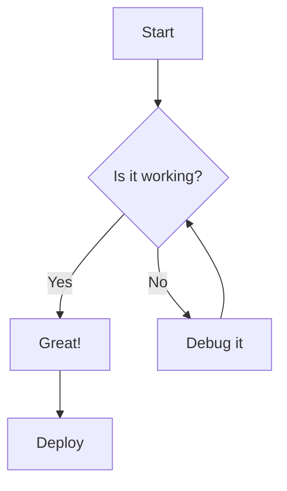
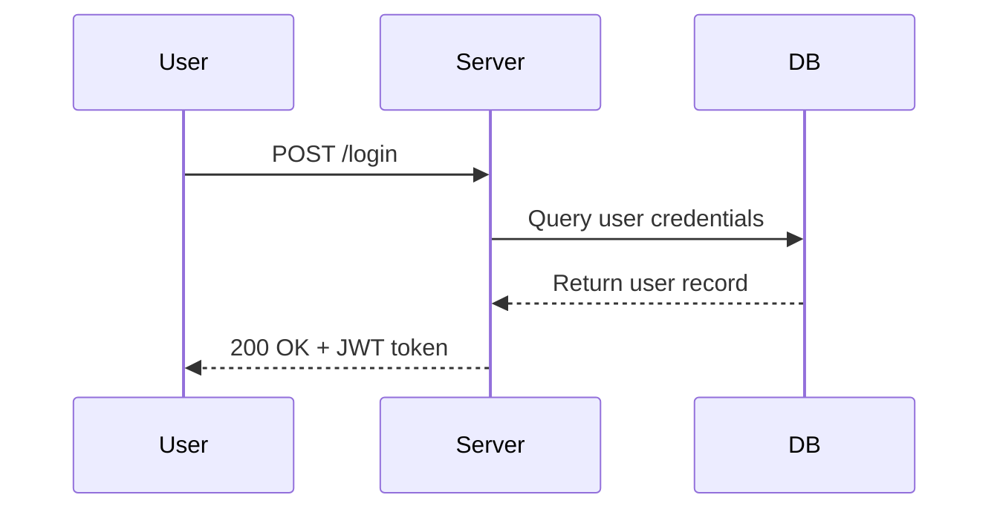
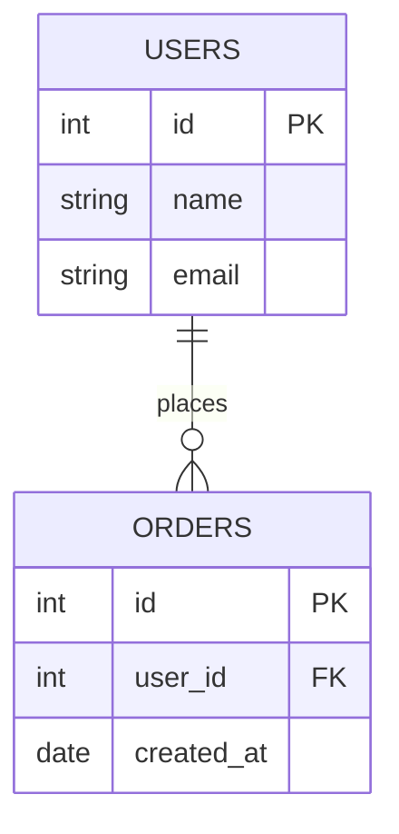
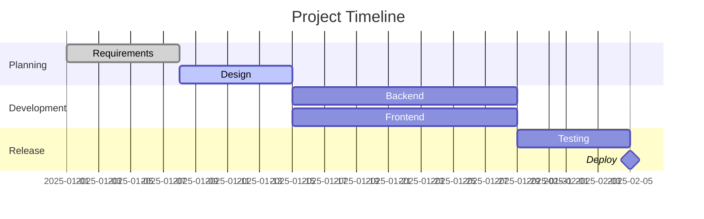
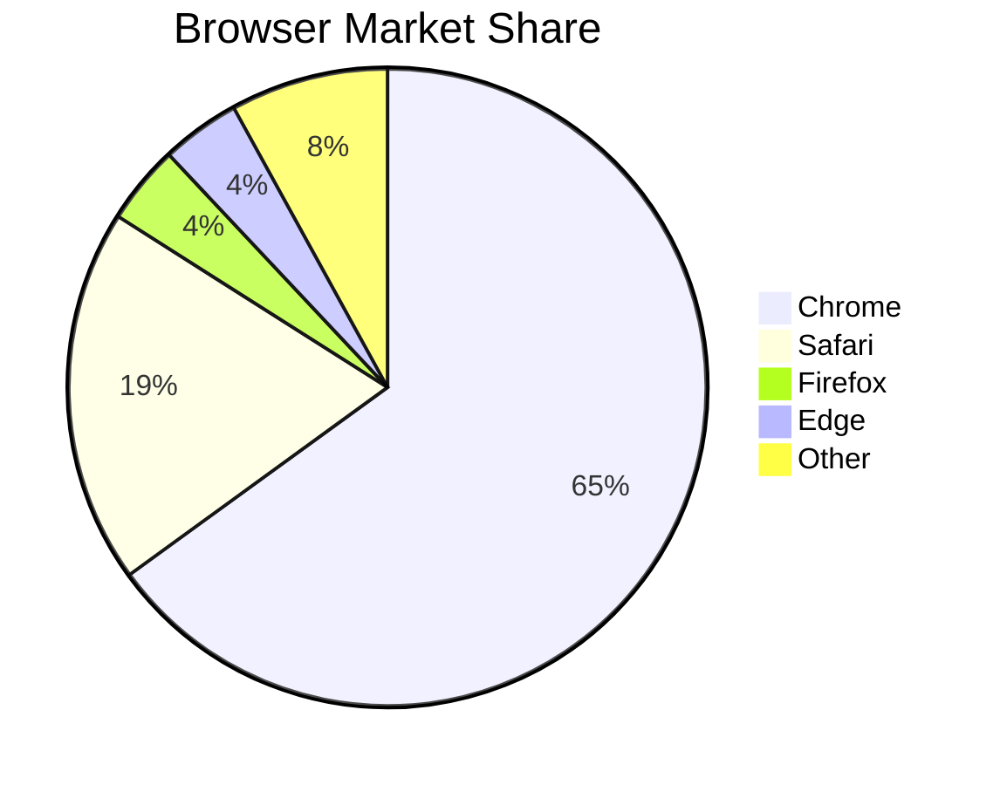
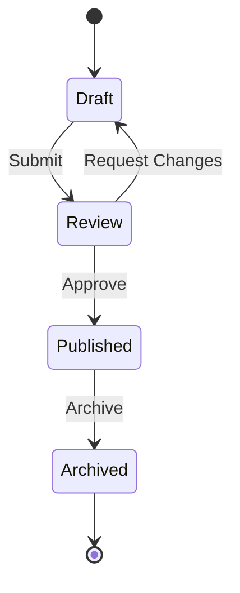

# Markdown Cheat Sheet — Complete Reference

> A comprehensive, no-fluff reference for everything Markdown. Covers CommonMark, GitHub Flavored Markdown (GFM), and extended syntax.

---

## Table of Contents

1. [Headings](#headings)
2. [Paragraphs & Line Breaks](#paragraphs--line-breaks)
3. [Emphasis](#emphasis)
4. [Blockquotes](#blockquotes)
5. [Lists](#lists)
6. [Code](#code)
7. [Horizontal Rules](#horizontal-rules)
8. [Links](#links)
9. [Images](#images)
10. [Tables](#tables)
11. [Task Lists](#task-lists)
12. [Footnotes](#footnotes)
13. [Definition Lists](#definition-lists)
14. [Strikethrough & Highlight](#strikethrough--highlight)
15. [Subscript & Superscript](#subscript--superscript)
16. [HTML in Markdown](#html-in-markdown)
17. [Escaping Characters](#escaping-characters)
18. [Emoji](#emoji)
19. [Automatic URL Linking](#automatic-url-linking)
20. [Frontmatter / YAML Header](#frontmatter--yaml-header)
21. [Math (LaTeX / KaTeX)](#math-latex--katex)
22. [Diagrams (Mermaid)](#diagrams-mermaid)
23. [Collapsible Sections](#collapsible-sections)
24. [Keyboard Keys](#keyboard-keys)
25. [Comments](#comments)
26. [Anchors & Cross-References](#anchors--cross-references)
27. [Best Practices & Pitfalls](#best-practices--pitfalls)

---

## Headings

Use `#` symbols. One `#` = H1, six `######` = H6. Always add a space after `#`.

```markdown
# H1 — Page Title
## H2 — Major Section
### H3 — Sub-section
#### H4 — Sub-sub-section
##### H5 — Deep section
###### H6 — Deepest level
```

**Alternate syntax (Setext style) — H1 and H2 only:**

```markdown
Heading Level 1
===============

Heading Level 2
---------------
```

> **Rules:**
> - Put a blank line before and after every heading.
> - Do not skip heading levels (H1 → H3) — bad for accessibility and document structure.
> - Only one H1 per document (the page title).

---

## Paragraphs & Line Breaks

| Goal | Syntax |
|---|---|
| New paragraph | Blank line between blocks |
| Soft line break (same paragraph) | End line with `\` or two trailing spaces `  ` |
| Hard line break | Blank line |

```markdown
This is paragraph one.

This is paragraph two.

This line ends with a backslash\
so this continues on a new line in the same paragraph.

This line ends with two spaces  
same effect as the backslash above.
```

> **Pitfall:** A single newline with no trailing spaces or `\` renders as a space, not a new line. You must use one of the methods above or insert a blank line.

---

## Emphasis

| Style | Syntax | Output |
|---|---|---|
| Bold | `**text**` or `__text__` | **text** |
| Italic | `*text*` or `_text_` | *text* |
| Bold + Italic | `***text***` or `___text___` | ***text*** |
| Bold + Italic mixed | `**bold and _italic_**` | **bold and _italic_** |

```markdown
**This is bold**
__This is also bold__

*This is italic*
_This is also italic_

***This is bold and italic***
___This is also bold and italic___

**Bold with _nested italic_ inside**
```

> **Rules:**
> - Prefer `**` for bold and `*` for italic to avoid ambiguity inside words.
> - `_italic_` does **not** trigger inside words like `un_der_score` (CommonMark) — use `*` for mid-word emphasis.
> - Nesting: always close inner markers before outer ones.

---

## Blockquotes

Prefix lines with `>`.

```markdown
> This is a simple blockquote.

> This blockquote spans
> multiple lines.

> **Blockquote with formatting**
> You can use *italic*, **bold**, and `code` inside.

> Nested blockquotes:
>
>> This is one level deeper.
>>
>>> And another level deeper still.
```

**Blockquote with other elements inside:**

```markdown
> ### Quote Heading
>
> - Item one
> - Item two
>
> Followed by a paragraph.
```

> **Rules:**
> - Use `>` on every line of a multi-line block, or use a single `>` with blank `>` lines between paragraphs.
> - Blank line before and after a blockquote for clean rendering.

---

## Lists

### Unordered Lists

Use `-`, `*`, or `+` (pick one and be consistent).

```markdown
- Item A
- Item B
  - Nested item B1      ← indent 2 spaces
  - Nested item B2
    - Deeply nested     ← indent 4 spaces
- Item C

* Asterisk works too
+ Plus works too
```

### Ordered Lists

```markdown
1. First item
2. Second item
3. Third item
   1. Nested ordered item
   2. Another nested item
4. Fourth item
```

> **Lazy numbering:** You can use `1.` for every item — most renderers auto-number.

```markdown
1. First
1. Second   ← still renders as "2."
1. Third    ← still renders as "3."
```

**Starting ordered list at a different number:**

```markdown
5. Starts at five
6. Six
7. Seven
```

### Nested Mixed Lists

```markdown
1. First ordered
   - Unordered sub-item
   - Another sub-item
     1. Ordered inside unordered
2. Second ordered
```

> **Rules:**
> - Indent nested items by 2 or 4 spaces (be consistent within a document).
> - Put a blank line before/after a list if it contains multi-paragraph items.
> - To continue a paragraph inside a list item, indent it to align with the text (not the bullet).

```markdown
- This is a list item with a paragraph.

  This second paragraph is part of the same list item (indented 2 spaces).

- Next item.
```

---

## Code

### Inline Code

Wrap with single backticks.

```markdown
Use `console.log()` to print to the console.
Use the `--save-dev` flag when installing dev dependencies.
```

### Fenced Code Blocks

Use triple backticks (` ``` `) or triple tildes (`~~~`).

````markdown
```
Plain code block, no syntax highlighting.
```

```python
def greet(name: str) -> str:
    return f"Hello, {name}!"

print(greet("World"))
```

```javascript
const add = (a, b) => a + b;
console.log(add(2, 3)); // 5
```

```bash
#!/bin/bash
echo "Hello from bash"
ls -la /home
```

```json
{
  "name": "my-project",
  "version": "1.0.0",
  "scripts": {
    "start": "node index.js"
  }
}
```

```sql
SELECT u.name, COUNT(o.id) AS order_count
FROM users u
LEFT JOIN orders o ON u.id = o.user_id
GROUP BY u.name
ORDER BY order_count DESC;
```
````

### Indented Code Block (legacy, 4 spaces)

```markdown
    This is a code block.
    Rendered in monospace.
    Works in all Markdown flavors.
```

### Displaying Backticks Inside Code

````markdown
Use double backticks to show a single backtick: `` ` ``

Use triple backticks to show double backticks: ``` `` ```

To show triple backticks, wrap in quadruple backticks:
```` ``` ````
````

**Common language identifiers:**

| Language | Identifier |
|---|---|
| Python | `python` |
| JavaScript | `javascript` or `js` |
| TypeScript | `typescript` or `ts` |
| Bash/Shell | `bash` or `sh` |
| HTML | `html` |
| CSS | `css` |
| JSON | `json` |
| YAML | `yaml` |
| SQL | `sql` |
| Rust | `rust` |
| Go | `go` |
| Java | `java` |
| C | `c` |
| C++ | `cpp` |
| C# | `csharp` |
| Kotlin | `kotlin` |
| Ruby | `ruby` |
| PHP | `php` |
| Swift | `swift` |
| R | `r` |
| Markdown | `markdown` or `md` |
| Dockerfile | `dockerfile` |
| XML | `xml` |
| Terraform | `hcl` |
| TOML | `toml` |
| Diff | `diff` |

---

## Horizontal Rules

Three or more `---`, `***`, or `___` on their own line. Add blank lines above and below.

```markdown
---

***

___
```

> **Pitfall:** `---` directly below a line of text turns it into a Setext H2 heading. Always use a blank line before `---`.

---

## Links

### Inline Links

```markdown
[Link text](https://example.com)
[Link with title](https://example.com "Tooltip text on hover")
[Relative link](./other-page.md)
[Link to heading anchor](#headings)
```

### Reference Links

Define once, use anywhere — keeps text readable.

```markdown
This is [Google][1] and this is [GitHub][gh].

[1]: https://www.google.com
[gh]: https://www.github.com "GitHub - Where the world builds software"
```

### Reference link shorthand (label = text):

```markdown
[Google][]

[Google]: https://www.google.com
```

### Auto-links

```markdown
<https://example.com>
<contact@example.com>
```

### Bare URLs (GFM only)

```markdown
https://example.com   ← GFM auto-links this without angle brackets
```

---

## Images

Same as links but prefixed with `!`. The alt text is shown if image fails to load and is critical for accessibility.

```markdown


<!-- Relative paths -->


```

### Reference-style images:

```markdown
![Alt text][logo]

[logo]: https://example.com/logo.png "Logo Title"
```

### Clickable image (image as a link):

```markdown
[](https://example.com)
```

### Image sizing (HTML fallback):

```html


```

> **Note:** Pure Markdown has no native image sizing. Use raw HTML when you need to control dimensions.

---

## Tables

GFM extension. Columns separated by `|`. Header separated from body by `---`.

```markdown
| Column 1 | Column 2 | Column 3 |
|----------|----------|----------|
| Cell A   | Cell B   | Cell C   |
| Cell D   | Cell E   | Cell F   |
```

### Alignment

```markdown
| Left Aligned | Center Aligned | Right Aligned |
|:-------------|:--------------:|--------------:|
| Left         | Center         | Right         |
| text         | text           | text          |
| 1            | 2              | 3             |
```

- `:---` = left align (default)
- `:---:` = center align
- `---:` = right align

### Rules & Tips:

```markdown
<!-- Pipes on the outside are optional -->
Column A | Column B
---------|----------
Cell 1   | Cell 2

<!-- Cells don't need to be perfectly aligned — just valid -->
| Short | A very long column header here |
|---|---|
| x | y |
```

> **Rules:**
> - At least one `---` in each separator cell.
> - No multi-line cells in standard Markdown — use HTML `<table>` if needed.
> - No merged cells in standard Markdown.
> - Content is auto-trimmed of leading/trailing spaces.

---

## Task Lists

GFM extension. Renders as checkboxes.

```markdown
- [x] Completed task
- [ ] Incomplete task
- [x] Another completed task
  - [x] Nested completed sub-task
  - [ ] Nested incomplete sub-task
- [ ] Last item
```

> **Note:** The checkbox may be interactive (clickable) on GitHub, GitLab, and some editors. In static renderers it is a visual checkbox only.

---

## Footnotes

Extended syntax (supported on GitHub, Pandoc, many static site generators).

```markdown
This is a sentence with a footnote.[^1]

Here is another statement.[^note]

[^1]: This is the first footnote text.
[^note]: This is a named footnote. It can span multiple lines
    if you indent continuation lines with 4 spaces.
```

> **Note:** Footnotes render at the bottom of the document automatically. You can define them anywhere in the source file.

---

## Definition Lists

Extended syntax (Pandoc, some SSGs — not GFM/GitHub).

```markdown
Term
:   Definition of the term.

Another Term
:   First definition.
:   Second definition for the same term.

Complex Term
:   A definition that can span multiple paragraphs.

    Just indent the continuation with 4 spaces.
```

---

## Strikethrough & Highlight

### Strikethrough (GFM)

```markdown
~~This text is struck through.~~
The feature was ~~deprecated~~ removed in v2.
```

### Highlight (Extended — not GFM, supported in Obsidian, Pandoc, etc.)

```markdown
==This text is highlighted.==
```

> **Note:** If `==highlight==` doesn't render, use raw HTML: `<mark>highlighted text</mark>`

---

## Subscript & Superscript

Not in CommonMark or GFM. Use HTML or extended syntax (Pandoc, Obsidian).

```markdown
<!-- Extended syntax -->
H~2~O           ← Subscript
X^2^            ← Superscript

<!-- HTML (works everywhere HTML is allowed) -->
H<sub>2</sub>O
E = mc<sup>2</sup>
```

---

## HTML in Markdown

Most Markdown renderers allow raw HTML inline or as block-level elements.

```markdown
This is **Markdown** with <em>HTML italic</em> inline.

<div style="color: red; font-weight: bold;">
  This entire block is raw HTML.
</div>

<details>
  <summary>Click to expand</summary>
  Hidden content revealed on click.
</details>

<br> <!-- Force a line break -->

<!-- Align text with HTML -->
<p align="center">Centered paragraph</p>

<!-- Colored text (works on GitHub README) -->
<span style="color:#e63946">Red text</span>
```

> **Rules:**
> - Block-level HTML must be separated from Markdown by blank lines.
> - Markdown syntax inside raw HTML blocks is **not** processed — use HTML tags inside HTML blocks.
> - `<script>` and `<style>` tags are stripped by most renderers for security.

---

## Escaping Characters

Prepend `\` to render a special character literally.

```markdown
\* Not italic \*
\# Not a heading
\[Not a link\]
\`Not code\`
\\ A literal backslash
\> Not a blockquote
\! Not an image
\- Not a list item
\. Not an ordered item (use in `1\.`)
\| Not a table separator
```

**Full list of escapable characters:**

```
\ ` * _ { } [ ] ( ) # + - . ! |
```

---

## Emoji

### Shortcode syntax (GFM, GitHub, Slack, many SSGs)

```markdown
:smile:         😄
:thumbsup:      👍
:fire:          🔥
:rocket:        🚀
:warning:       ⚠️
:white_check_mark: ✅
:x:             ❌
:bulb:          💡
:star:          ⭐
:heart:         ❤️
:tada:          🎉
:eyes:          👀
:zap:           ⚡
:memo:          📝
:bug:           🐛
:construction:  🚧
:lock:          🔒
:key:           🔑
:gear:          ⚙️
:link:          🔗
```

> Find full emoji shortcode list at: https://github.com/ikatyang/emoji-cheat-sheet

### Direct Unicode emoji

```markdown
You can also paste emoji directly: 😄 🚀 ✅ ❌ ⚠️
```

---

## Automatic URL Linking

```markdown
<!-- GFM auto-links bare URLs -->
Visit https://example.com for more info.

<!-- Standard Markdown: use angle brackets -->
Visit <https://example.com> for more info.

<!-- Disable auto-linking with backticks -->
`https://example.com` — rendered as code, not a link.
```

---

## Frontmatter / YAML Header

Not part of CommonMark/GFM but widely supported (Jekyll, Hugo, Obsidian, Pandoc, etc.). Must be the very first content in the file.

```markdown
---
title: "My Document Title"
author: "Jane Doe"
date: 2025-01-01
description: "A short description for SEO and previews."
tags:
  - markdown
  - documentation
  - reference
categories:
  - guides
draft: false
slug: "my-document-title"
image: "/images/cover.png"
toc: true
weight: 10
---

# Document content starts here
```

> **Rules:**
> - Wrapped in `---` delimiters (some tools use `+++` for TOML frontmatter).
> - Must start on line 1 with no blank line before the opening `---`.
> - Rendered as metadata — not shown in the document body.

---

## Math (LaTeX / KaTeX)

Supported in: GitHub (limited), Jupyter, Obsidian, MkDocs, Pandoc, most static site generators.

### Inline Math

```markdown
The formula is $E = mc^2$.

The quadratic formula is $x = \frac{-b \pm \sqrt{b^2 - 4ac}}{2a}$.
```

### Block Math

```markdown
$$
\int_{-\infty}^{\infty} e^{-x^2} dx = \sqrt{\pi}
$$

$$
\sum_{n=1}^{\infty} \frac{1}{n^2} = \frac{\pi^2}{6}
$$

$$
\begin{pmatrix}
a & b \\
c & d
\end{pmatrix}
\begin{pmatrix}
x \\
y
\end{pmatrix}
=
\begin{pmatrix}
ax + by \\
cx + dy
\end{pmatrix}
$$
```

**Useful LaTeX symbols:**

| Symbol | LaTeX |
|---|---|
| α β γ δ | `\alpha \beta \gamma \delta` |
| ∑ ∏ ∫ | `\sum \prod \int` |
| ≤ ≥ ≠ ≈ | `\leq \geq \neq \approx` |
| ∞ | `\infty` |
| √x | `\sqrt{x}` |
| x² | `x^2` |
| xₙ | `x_n` |
| a/b fraction | `\frac{a}{b}` |
| → ← ↔ | `\to \leftarrow \leftrightarrow` |
| × ÷ ± | `\times \div \pm` |
| ∈ ∉ ∅ | `\in \notin \emptyset` |
| ∀ ∃ | `\forall \exists` |

---

## Diagrams (Mermaid)

Supported on GitHub, GitLab, Obsidian, Notion, many static site generators. Uses fenced code blocks with the `mermaid` language identifier.

### Flowchart

````markdown

````

### Sequence Diagram

````markdown

````

### Entity Relationship Diagram

````markdown

````

### Gantt Chart

````markdown

````

### Pie Chart

````markdown

````

### State Diagram

````markdown

````

---

## Collapsible Sections

Uses raw HTML `<details>` and `<summary>` tags. Works on GitHub, GitLab, and most renderers that allow HTML.

```markdown
<details>
<summary>Click to expand this section</summary>

This content is hidden until the user clicks.

You can include **Markdown** inside, but leave a blank line after `<summary>` first.

- List item
- Another item

```python
print("Code works here too")
```

</details>
```

**Nested collapsible:**

```markdown
<details>
<summary>Outer Section</summary>

Some outer content.

<details>
<summary>Inner Section</summary>

Nested hidden content.

</details>
</details>
```

> **Critical:** Leave a blank line after `</summary>` for Markdown inside `<details>` to render properly.

---

## Keyboard Keys

Use `<kbd>` HTML tag. Universally supported and renders with a key-cap look.

```markdown
Press <kbd>Ctrl</kbd> + <kbd>C</kbd> to copy.
Press <kbd>Cmd</kbd> + <kbd>Shift</kbd> + <kbd>P</kbd> to open command palette.
Save with <kbd>Ctrl</kbd> + <kbd>S</kbd> or <kbd>Cmd</kbd> + <kbd>S</kbd>.
<kbd>Esc</kbd> to cancel.
<kbd>Tab</kbd> to indent.
<kbd>Enter</kbd> to confirm.
```

---

## Comments

Markdown has no native comment syntax, but HTML comments are stripped from rendered output:

```markdown
<!-- This is a comment and will NOT appear in rendered output. -->

<!-- 
  Multi-line comment.
  None of this is visible to readers.
-->

<!-- TODO: Add more examples here -->
<!-- DRAFT: Section below is incomplete -->
```

> **Note:** HTML comments still exist in the page source — they are not truly private. Do not put sensitive information in comments.

---

## Anchors & Cross-References

### Auto-generated anchors from headings

Every heading generates an anchor automatically. The ID is:
1. Lowercased
2. Spaces replaced with `-`
3. Special characters removed (punctuation, symbols)
4. Leading/trailing hyphens removed

```markdown
## My Section Title      → #my-section-title
## API Reference (v2)    → #api-reference-v2
## C++ / C# Support      → #c--c-support
## What's New?           → #whats-new
```

### Linking to headings in the same document:

```markdown
[Go to Headings section](#headings)
[Jump to Tables](#tables)
[Back to top](#markdown-cheat-sheet--complete-reference)
```

### Linking to headings in another file:

```markdown
[See Installation](./docs/setup.md#installation)
[Read the API docs](../api.md#endpoints)
```

### Custom anchors (HTML):

```markdown
<a id="custom-anchor"></a>

Link to it: [Jump here](#custom-anchor)
```

---

## Best Practices & Pitfalls

### Document Structure

```markdown
<!-- ✅ DO -->
# One H1 per document (the title)
## Multiple H2s for major sections
### H3 for sub-sections
#### H4 when needed — don't go deeper if avoidable

<!-- ❌ DON'T -->
# Title
### Skipping H2 is bad for structure
```

### Blank Lines

```markdown
<!-- ✅ Always put blank lines before/after: -->
- Block-level elements (headings, lists, blockquotes, code blocks, tables, HR)
- Avoids ambiguous parsing across all renderers

<!-- ❌ This can break rendering -->
## Heading
- list item
> blockquote with no blank lines between them
```

### Trailing Spaces

```markdown
Line one  
Line two        ← two trailing spaces = line break (invisible, easy to miss)

Line one\
Line two        ← preferred: backslash is visible
```

> **Tip:** Use `\` instead of two trailing spaces — it's explicit and not accidentally stripped by editors.

### Consistency

```markdown
<!-- Pick ONE style per document and stick to it -->

<!-- Unordered lists -->
- Use hyphens  ← preferred
* or asterisks
+ or plus signs

<!-- Bold -->
**double asterisks**  ← preferred
__double underscores__

<!-- Italic -->
*single asterisk*     ← preferred
_single underscore_
```

### Long Lines

```markdown
<!-- ✅ Wrap at ~80–120 characters for readability in source -->
This is a very long paragraph that gets hard to read in raw form when
it stretches beyond a comfortable line length, so wrap it manually.

<!-- Both render identically — blank line = paragraph break, soft wrap = space -->
```

### Special Characters in URLs

```markdown
<!-- ✅ Encode spaces as %20 or use angle brackets -->
[File with spaces](<./my file name.md>)
[Encoded](./my%20file%20name.md)
```

### File Extensions in Links

```markdown
<!-- For GitHub/GitLab wiki and local rendering -->
[Other page](./other-page.md)    ← include .md extension

<!-- For web-published sites (HTML output) -->
[Other page](./other-page/)     ← omit extension (URL-based)
```

### Tables — Alignment in Source

```markdown
<!-- Both are valid; pipe alignment is cosmetic only -->

<!-- ✅ Aligned (readable source) -->
| Name    | Age | City        |
|---------|-----|-------------|
| Alice   | 30  | New York    |
| Bob     | 25  | Los Angeles |

<!-- ✅ Unaligned (still renders correctly) -->
| Name | Age | City |
|---|---|---|
| Alice | 30 | New York |
| Bob | 25 | Los Angeles |
```

### Code Blocks — Avoid Indented Style

```markdown
<!-- ❌ Avoid indented code blocks (4 spaces) — can conflict with lists -->
    indented code block

<!-- ✅ Use fenced code blocks always -->
```python
fenced code block
```
```

---

## Quick Reference Card

| Element | Syntax |
|---|---|
| H1 | `# Heading` |
| H2 | `## Heading` |
| H3 | `### Heading` |
| Bold | `**text**` |
| Italic | `*text*` |
| Bold + Italic | `***text***` |
| Strikethrough | `~~text~~` |
| Inline code | `` `code` `` |
| Code block | ```` ```lang ```` |
| Link | `[text](url)` |
| Image | `` |
| Blockquote | `> text` |
| Unordered list | `- item` |
| Ordered list | `1. item` |
| Task list | `- [x] done` / `- [ ] todo` |
| Horizontal rule | `---` |
| Table | `\| col \| col \|` |
| Footnote | `[^1]` + `[^1]: text` |
| Escape | `\*` |
| HTML comment | `<!-- comment -->` |
| Line break | `\` or `  ` (2 spaces) |
| Auto-link | `<https://url>` |
| Emoji | `:emoji_name:` |
| Highlight | `==text==` |
| Subscript | `H~2~O` |
| Superscript | `E=mc^2^` |
| Keyboard key | `<kbd>Ctrl</kbd>` |
| Inline math | `$E=mc^2$` |
| Block math | `$$...$$` |

---

## Renderer Compatibility Matrix

| Feature | CommonMark | GFM (GitHub) | GitLab | Obsidian | Pandoc |
|---|:---:|:---:|:---:|:---:|:---:|
| Headings | ✅ | ✅ | ✅ | ✅ | ✅ |
| Bold / Italic | ✅ | ✅ | ✅ | ✅ | ✅ |
| Tables | ❌ | ✅ | ✅ | ✅ | ✅ |
| Task Lists | ❌ | ✅ | ✅ | ✅ | ✅ |
| Strikethrough | ❌ | ✅ | ✅ | ✅ | ✅ |
| Footnotes | ❌ | ✅ | ✅ | ✅ | ✅ |
| Definition Lists | ❌ | ❌ | ❌ | ✅ | ✅ |
| Highlight `==` | ❌ | ❌ | ❌ | ✅ | ❌ |
| Subscript `~` | ❌ | ❌ | ✅ | ✅ | ✅ |
| Superscript `^` | ❌ | ❌ | ✅ | ✅ | ✅ |
| Math `$` | ❌ | ✅ | ✅ | ✅ | ✅ |
| Mermaid diagrams | ❌ | ✅ | ✅ | ✅ | ❌ |
| Frontmatter | ❌ | ✅ | ✅ | ✅ | ✅ |
| Auto-links | ❌ | ✅ | ✅ | ✅ | ✅ |
| HTML tags | ✅ | ✅ | ✅ | ✅ | ✅ |

---

*This cheat sheet follows CommonMark + GFM conventions unless otherwise noted.*
