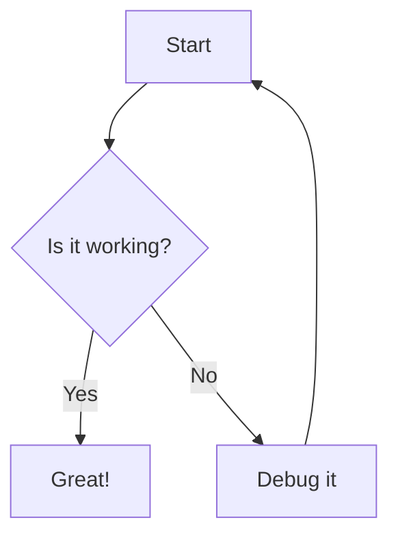
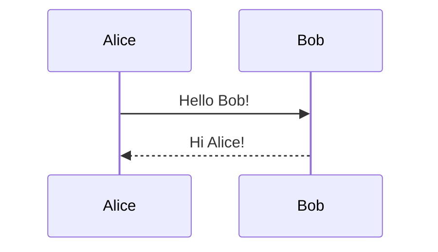
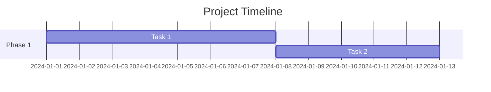
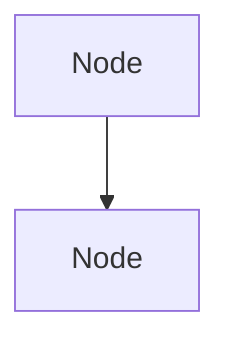

# The Complete Markdown Guide
### Everything You Need to Write .md Files Like a Pro

---

## Table of Contents

1. [What is Markdown?](#what-is-markdown)
2. [Headings](#headings)
3. [Paragraphs and Line Breaks](#paragraphs-and-line-breaks)
4. [Text Formatting](#text-formatting)
5. [Blockquotes](#blockquotes)
6. [Lists](#lists)
7. [Code](#code)
8. [Horizontal Rules](#horizontal-rules)
9. [Links](#links)
10. [Images](#images)
11. [Tables](#tables)
12. [Task Lists / Checkboxes](#task-lists--checkboxes)
13. [Footnotes](#footnotes)
14. [Strikethrough and Highlight](#strikethrough-and-highlight)
15. [Escaping Special Characters](#escaping-special-characters)
16. [HTML in Markdown](#html-in-markdown)
17. [Emoji](#emoji)
18. [Definition Lists](#definition-lists)
19. [Superscript and Subscript](#superscript-and-subscript)
20. [Abbreviations](#abbreviations)
21. [Comments in Markdown](#comments-in-markdown)
22. [YAML Front Matter](#yaml-front-matter)
23. [Mermaid Diagrams (in supported renderers)](#mermaid-diagrams)
24. [Common Mistakes and Pitfalls](#common-mistakes-and-pitfalls)
25. [Cheat Sheet](#cheat-sheet)

---

## What is Markdown?

Markdown is a **lightweight markup language** created by John Gruber in 2004. It lets you write plain text that gets converted into nicely formatted HTML (or PDF, DOCX, etc.). You write using simple symbols like `#`, `*`, `-`, and backticks — and the renderer turns them into headings, bold text, lists, code blocks, and more.

**Common places you use Markdown:**
- GitHub README files (`.md` files in repos)
- Obsidian, Notion, Typora, Joplin notes
- Reddit posts
- Discord messages
- Documentation sites (GitBook, MkDocs)
- Jupyter Notebooks

> ⚠️ **WARNING:** Not all Markdown renderers support every feature in this guide. Standard CommonMark features (headings, bold, lists, code) work everywhere. Extended features like tables, task lists, footnotes, and YAML front matter depend on the renderer.

---

## Headings

Headings are created using the `#` symbol followed by a space.

```markdown
# Heading 1
## Heading 2
### Heading 3
#### Heading 4
##### Heading 5
###### Heading 6
```

**Renders as:**

# Heading 1
## Heading 2
### Heading 3
#### Heading 4
##### Heading 5
###### Heading 6

---

> ⚠️ **WARNING:** Always put a **space** between the `#` and your heading text.
> - `#Heading` → WRONG — may not render as a heading
> - `# Heading` → CORRECT

> ⚠️ **WARNING:** Leave a **blank line before and after** every heading for guaranteed rendering across all parsers.

**Alternative H1 and H2 (Setext style) — less common:**
```markdown
Heading 1
=========

Heading 2
---------
```

> ⚠️ **WARNING:** The Setext style only works for H1 and H2. Use `#` style for H3 through H6. It's best to stick with `#` style throughout for consistency.

---

## Paragraphs and Line Breaks

A paragraph is just one or more lines of text separated by a **blank line**.

```markdown
This is the first paragraph.

This is the second paragraph.
```

**Line break within a paragraph:**

To force a line break (like pressing Enter once) without starting a new paragraph, end the line with **two or more spaces** and then press Enter:

```markdown
First line with two trailing spaces  
Second line (same paragraph, new line)
```

> ⚠️ **WARNING:** Trailing spaces are invisible. If line breaks aren't working, this is the most common reason. Some editors strip trailing whitespace automatically.

> ⚠️ **WARNING:** A single newline (pressing Enter once without trailing spaces) does **not** create a line break in most Markdown renderers — the two lines will merge into one paragraph.

**Alternative line break (more reliable):**
```markdown
First line<br>
Second line
```

Using `<br>` is HTML and works in most renderers.

---

## Text Formatting

### Bold

```markdown
**This text is bold**
__This text is also bold__
```

**This text is bold**

> ⚠️ **WARNING:** Using `__double underscores__` for bold can fail if the word is inside another word (e.g., `un__believable__`). Always prefer `**asterisks**` for bold to avoid rendering issues.

---

### Italic

```markdown
*This text is italic*
_This text is also italic_
```

*This text is italic*

> ⚠️ **WARNING:** Same rule — prefer `*asterisks*` over `_underscores_` for italic to avoid edge-case rendering issues with underscores inside words.

---

### Bold AND Italic

```markdown
***This is bold and italic***
___This is also bold and italic___
**_This works too_**
*__This works too__*
```

***This is bold and italic***

> ⚠️ **WARNING:** Mix of `***` is the most universally supported. Some older parsers do not handle `___` correctly.

---

### Inline Code

```markdown
Use the `print()` function.
```

Use the `print()` function.

> ⚠️ **WARNING:** Backtick code spans do not render bold, italic, or any other formatting inside them. What you type is what you get.

---

## Blockquotes

Use `>` at the start of a line:

```markdown
> This is a blockquote.
```

> This is a blockquote.

**Nested blockquotes:**
```markdown
> Level 1 quote
>> Level 2 quote
>>> Level 3 quote
```

> Level 1 quote
>> Level 2 quote
>>> Level 3 quote

**Multi-line blockquote:**
```markdown
> This is the first line of the blockquote.
> This is the second line, still inside.
>
> This is a new paragraph inside the same blockquote.
```

> ⚠️ **WARNING:** Leave a blank `>` line (just `>`) between paragraphs inside a blockquote, not a completely empty line — otherwise the blockquote breaks into two separate ones.

**Blockquote with other elements:**
```markdown
> #### This heading is inside a blockquote
>
> - item one
> - item two
>
> **Bold text** inside a quote.
```

---

## Lists

### Unordered Lists

Use `-`, `*`, or `+` followed by a space:

```markdown
- Item one
- Item two
- Item three
```

```markdown
* Item one
* Item two
```

```markdown
+ Item one
+ Item two
```

> ⚠️ **WARNING:** Do **not** mix `-`, `*`, and `+` in the same list. Some renderers treat them as separate lists. Pick one and stick with it throughout.

> ⚠️ **WARNING:** Always put a **space after the `-`, `*`, or `+`**. No space = not a list item.

---

### Ordered Lists

```markdown
1. First item
2. Second item
3. Third item
```

1. First item
2. Second item
3. Third item

> ⚠️ **WARNING:** The **actual numbers don't matter** for most renderers — they auto-number. But starting the first item with `1.` is required. You can write all items as `1.` and it will still render as 1, 2, 3:

```markdown
1. First item
1. Second item
1. Third item
```

> ⚠️ **WARNING:** There must be a **period (`.`) after the number**, not just the number. `1 Item` is not a list. `1. Item` is.

---

### Nested Lists

Indent with **2 or 4 spaces** (be consistent) to create sub-items:

```markdown
- Main item
  - Sub-item
    - Sub-sub-item
  - Another sub-item
- Another main item
```

> ⚠️ **WARNING:** Use consistent indentation — either **always 2 spaces** or **always 4 spaces** within a document. Mixing 2 and 4 spaces can break nesting in some parsers. **Do NOT use Tab characters** for indentation — tabs are interpreted inconsistently across renderers.

---

### Mixing Ordered and Unordered

```markdown
1. Step one
   - Sub-bullet under step one
   - Another sub-bullet
2. Step two
   1. Numbered sub-step
   2. Another numbered sub-step
```

---

### List Continuation (Paragraphs inside lists)

To add a paragraph or block inside a list item without breaking the list, indent it to align with the list item's content:

```markdown
- First item

  This paragraph belongs to the first item.

- Second item
```

> ⚠️ **WARNING:** If the continuation content is not indented far enough (at least to where the text starts), it will break out of the list and render as a separate paragraph.

---

## Code

### Inline Code

Wrap text in single backticks:

```markdown
Run `npm install` to install dependencies.
```

Run `npm install` to install dependencies.

---

### Fenced Code Blocks

Use triple backticks (` ``` `) before and after:

````markdown
```
This is a plain code block.
No syntax highlighting.
```
````

---

### Syntax Highlighted Code Blocks

Add the language name right after the opening backticks:

````markdown
```python
def greet(name):
    print(f"Hello, {name}!")
```
````

```python
def greet(name):
    print(f"Hello, {name}!")
```

**Popular language identifiers:**

| Language | Identifier |
|----------|------------|
| Python | `python` |
| JavaScript | `javascript` or `js` |
| Bash / Shell | `bash` or `shell` or `sh` |
| HTML | `html` |
| CSS | `css` |
| SQL | `sql` |
| JSON | `json` |
| YAML | `yaml` |
| C | `c` |
| C++ | `cpp` |
| Java | `java` |
| Go | `go` |
| Rust | `rust` |
| TypeScript | `typescript` or `ts` |
| Markdown | `markdown` or `md` |
| Dockerfile | `dockerfile` |
| Plain text | `text` or `plaintext` |

> ⚠️ **WARNING:** The language name must come **immediately after the opening triple backticks** with **no space**. ` ```python ` is correct. ` ``` python ` (with space) may not trigger highlighting in all renderers.

---

### Indented Code Blocks (4-space style)

You can also create code blocks by indenting every line with **4 spaces**:

```
    This is a code block
    indented by 4 spaces
```

> ⚠️ **WARNING:** The 4-space style **cannot** have syntax highlighting and can conflict with list item indentation. Prefer triple backtick fenced blocks — they are more readable and powerful.

---

### Code Block Inside a Code Block

If your code block contains triple backticks, wrap it with quadruple backticks:

`````markdown
````
```python
print("hello")
```
````
`````

---

## Horizontal Rules

Create a horizontal line (divider) using three or more of: `---`, `***`, or `___`

```markdown
---
***
___
```

> ⚠️ **WARNING:** Always put a **blank line before a `---` divider**. Without the blank line, `---` immediately after a line of text will be interpreted as an H2 heading (Setext style), not a horizontal rule.

```markdown
This is a heading
---

vs.

This is a paragraph.

---

This is a divider above.
```

---

## Links

### Inline Links

```markdown
[Link text](https://www.example.com)
```

[Link text](https://www.example.com)

**With a title (tooltip on hover):**
```markdown
[Link text](https://www.example.com "Tooltip text here")
```

---

### Reference-Style Links

Define the link target separately (useful when the same URL is used many times):

```markdown
[Link text][reference-id]

[reference-id]: https://www.example.com "Optional title"
```

The reference definition line can go anywhere in the document (usually at the bottom).

---

### Auto-links

Wrap a URL in angle brackets to auto-link it:

```markdown
<https://www.example.com>
<email@example.com>
```

<https://www.example.com>

---

### Linking to a Heading (Anchor Links)

In most Markdown renderers (GitHub, Obsidian), you can link to a section in the same document:

```markdown
[Go to Lists section](#lists)
```

Rules for heading anchors:
- All letters are lowercased
- Spaces become `-` hyphens
- Special characters are removed
- Example: `## My Great Heading` → `#my-great-heading`

> ⚠️ **WARNING:** Anchor link rules vary by renderer. GitHub strips most special characters and lowercases everything. Obsidian may behave differently. Test your anchor links in your target renderer.

---

### Relative Links (within a project)

```markdown
[See the docs](./docs/README.md)
[Go up one folder](../index.md)
[Link to image](./images/screenshot.png)
```

---

## Images

The syntax is like a link but with `!` in front:

```markdown


```

**With a reference-style:**
```markdown
![Alt text][image-ref]

[image-ref]: ./image.png "Optional title"
```

**Clickable image (image that is also a link):**
```markdown
[](https://example.com)
```

> ⚠️ **WARNING:** The **alt text** (inside `[]`) is important for accessibility and for when images fail to load. Never leave it empty if you care about accessibility. `` with empty alt is valid but bad practice.

> ⚠️ **WARNING:** Markdown does **not** natively support controlling image size. If you need to resize, use raw HTML: ``

---

## Tables

Tables use `|` (pipe) characters to separate columns and `---` to define the header row:

```markdown
| Column 1 | Column 2 | Column 3 |
|----------|----------|----------|
| Cell A   | Cell B   | Cell C   |
| Cell D   | Cell E   | Cell F   |
```

| Column 1 | Column 2 | Column 3 |
|----------|----------|----------|
| Cell A   | Cell B   | Cell C   |
| Cell D   | Cell E   | Cell F   |

---

### Column Alignment

```markdown
| Left Aligned | Center Aligned | Right Aligned |
|:-------------|:--------------:|--------------:|
| text         |     text       |          text |
| text         |     text       |          text |
```

| Left Aligned | Center Aligned | Right Aligned |
|:-------------|:--------------:|--------------:|
| text         |     text       |          text |

- `:---` → Left align
- `:---:` → Center align
- `---:` → Right align
- `---` → Default (usually left)

> ⚠️ **WARNING:** You **must** have the separator row (`|---|---|`) between the header row and the body rows. Without it, the table will not render.

> ⚠️ **WARNING:** The pipes `|` at the start and end of rows are technically optional in some parsers, but **always include them** for compatibility. `Col1 | Col2` may break; `| Col1 | Col2 |` always works.

> ⚠️ **WARNING:** You **cannot** create multi-row cells or merged cells in standard Markdown tables. For complex tables, use HTML `<table>` tags instead.

> ⚠️ **WARNING:** If your cell content contains a `|` pipe character, escape it with a backslash: `\|`

---

## Task Lists / Checkboxes

(GitHub Flavored Markdown, Obsidian, many others)

```markdown
- [x] Completed task
- [ ] Incomplete task
- [x] Another done task
- [ ] One more to do
```

- [x] Completed task
- [ ] Incomplete task

> ⚠️ **WARNING:** The space inside the brackets matters:
> - `[x]` = checked
> - `[ ]` = unchecked (there **must** be a space between the brackets)
> - `[]` without space = **will not render as a checkbox** in most renderers

> ⚠️ **WARNING:** Task lists are **not part of core Markdown** — they are a GitHub Flavored Markdown (GFM) extension. They may not render in all editors/renderers.

---

## Footnotes

(Supported in GitHub, Pandoc, many extended parsers)

```markdown
Here is a sentence with a footnote.[^1]

Another sentence with a named footnote.[^note]

[^1]: This is the first footnote.
[^note]: This is a named footnote. It can span
    multiple lines if indented.
```

The footnotes render at the bottom of the document automatically.

> ⚠️ **WARNING:** Footnotes are **not standard CommonMark**. They work on GitHub, Obsidian, and Pandoc, but not in basic Markdown renderers. Check if your renderer supports them before using.

---

## Strikethrough and Highlight

### Strikethrough

(GitHub Flavored Markdown and most extended parsers)

```markdown
~~This text is struck through~~
```

~~This text is struck through~~

> ⚠️ **WARNING:** Use **double** tildes `~~`. Single tilde `~` does not render strikethrough in most parsers.

---

### Highlight

(Obsidian, some extended parsers — NOT standard GFM)

```markdown
==This text is highlighted==
```

> ⚠️ **WARNING:** Highlight with `==` is **not supported** in GitHub Markdown or most basic renderers. It works in Obsidian, Typora, and some others. Use with caution.

---

## Escaping Special Characters

If you want to display a character that Markdown would normally treat as formatting (like `*`, `#`, `[`, etc.), escape it with a backslash `\`:

```markdown
\*This is not italic\*
\# This is not a heading
\[This is not a link\]
\`This is not code\`
\> This is not a blockquote
\- This is not a list item
\| This is not a table pipe
```

**Full list of escapable characters:**

```
\ ` * _ { } [ ] ( ) # + - . ! |
```

> ⚠️ **WARNING:** Backslash escapes **only work** in places where Markdown formatting applies. Inside a fenced code block, backslashes are treated literally and do **not** escape anything.

---

## HTML in Markdown

Most Markdown renderers allow raw HTML to be embedded:

```markdown
<b>Bold with HTML</b>
<i>Italic with HTML</i>
<u>Underlined</u>
<br>
<hr>
<mark>Highlighted text</mark>
<small>Smaller text</small>
<sup>Superscript</sup>
<sub>Subscript</sub>
<details>
  <summary>Click to expand</summary>
  Hidden content here.
</details>
```

**The `<details>` collapsible section is very useful on GitHub:**

```markdown
<details>
  <summary>Click to see more</summary>

  This content is hidden by default.
  You can put **Markdown** here too.

</details>
```

> ⚠️ **WARNING:** When mixing HTML and Markdown inside HTML tags, leave **blank lines** between the HTML tag and the Markdown content for the Markdown to render:
> ```
> <div>
>
> **This bold will render** because of the blank lines.
>
> </div>
> ```
> Without blank lines, the Markdown inside may be treated as raw text.

> ⚠️ **WARNING:** Some renderers (for security reasons) strip HTML entirely. GitHub allows a safe subset. Obsidian allows more. Always check your renderer.

---

## Emoji

(GitHub, Obsidian, many extended renderers)

**Using shortcodes:**
```markdown
:smile: :rocket: :warning: :checkmark: :x:
```

:smile: :rocket: :warning:

**Using Unicode directly:**
```markdown
🚀 ✅ ⚠️ ❌ 💡 🔥
```

> ⚠️ **WARNING:** Emoji shortcodes like `:smile:` only work on platforms that support them (GitHub, Slack, Notion). For universal support, paste the actual emoji character (🚀) instead of the shortcode.

---

## Definition Lists

(Supported in Pandoc, PHP Markdown Extra, Obsidian — NOT in GitHub GFM)

```markdown
Term 1
:   Definition of term 1

Term 2
:   First definition of term 2
:   Second definition of term 2
```

> ⚠️ **WARNING:** Definition lists are **not widely supported**. They work in Pandoc-converted documents and some extended parsers, but **not on GitHub**. Use a table or bold term + paragraph as an alternative for wider compatibility.

---

## Superscript and Subscript

(Supported in Pandoc, Obsidian, some parsers — NOT standard GFM)

```markdown
H~2~O   (subscript)
x^2^    (superscript)
```

**HTML alternative (more universal):**
```markdown
H<sub>2</sub>O
x<sup>2</sup>
```

> ⚠️ **WARNING:** `~subscript~` and `^superscript^` syntax is **not supported on GitHub**. Use HTML `<sub>` and `<sup>` tags for compatibility.

---

## Abbreviations

(PHP Markdown Extra, Kramdown — NOT CommonMark or GFM)

```markdown
The HTML spec is maintained by the W3C.

*[HTML]: HyperText Markup Language
*[W3C]: World Wide Web Consortium
```

When rendered, hovering over "HTML" shows "HyperText Markup Language".

> ⚠️ **WARNING:** Abbreviations are **very limited in support** — mainly Kramdown (used by Jekyll/GitHub Pages) and PHP Markdown Extra. Not available on GitHub.com or Obsidian by default.

---

## Comments in Markdown

Markdown has no native comment syntax. Use HTML comments:

```markdown
<!-- This is a comment and will NOT appear in the rendered output -->

<!-- 
  This is a 
  multi-line comment
-->
```

> ⚠️ **WARNING:** HTML comments are removed from rendered output in most renderers, but the raw `.md` file still contains them. Do **not** put sensitive information in comments — anyone who can read the source file can see them.

---

## YAML Front Matter

(GitHub Pages, Jekyll, Hugo, Obsidian, Pandoc, and many static site generators)

YAML front matter is metadata placed at the **very beginning** of the file between triple-dashes:

```markdown
---
title: My Document Title
date: 2024-12-01
author: Praneeth
tags: [linux, cybersecurity, notes]
draft: false
---

# Actual content starts here
```

> ⚠️ **WARNING:** The opening `---` **must be the very first line** of the file. Even one blank line before it will break YAML front matter parsing in most tools.

> ⚠️ **WARNING:** Use proper YAML syntax inside the block — don't skip colons, quote strings with special characters, and use correct list syntax.

> ⚠️ **WARNING:** YAML front matter is **invisible in rendered output** — it's metadata for the renderer/tool. Do not confuse it with a heading or divider.

---

## Mermaid Diagrams

(GitHub, Obsidian, GitLab, and many modern renderers)

Mermaid lets you create diagrams using text inside a `mermaid` code block:

**Flowchart:**
````markdown

````

**Sequence Diagram:**
````markdown

````

**Gantt Chart:**
````markdown

````

> ⚠️ **WARNING:** Mermaid rendering requires the renderer to specifically support it. It works natively on GitHub (since 2022), GitLab, and Obsidian, but NOT in standard Markdown renderers.

---

## Common Mistakes and Pitfalls

### 1. No blank line before/after block elements

```markdown
Some paragraph text
# This heading has no blank line before it — may not render correctly

Some paragraph text

# This heading has a blank line — correct
```

---

### 2. Indentation with Tabs vs Spaces

> ⚠️ **WARNING:** Always use **spaces** for indentation in Markdown — never Tab characters. Tabs are interpreted as 4 spaces in some parsers and differently in others, causing broken lists and code blocks.

---

### 3. Forgetting blank lines around lists and code blocks

```markdown
Some text
- This list has no blank line before it

Some text

- This list has a blank line — more compatible
```

---

### 4. Using underscores inside words for italic

```markdown
do_not_use_underscores_for_italic_inside_words
```

The `_` inside a word can confuse parsers. Use `*` for italic always:

```markdown
*use asterisks* for italic
```

---

### 5. Forgetting to close bold/italic

```markdown
**this is bold but I forgot to close it
This whole rest of the paragraph may be bold accidentally
```

---

### 6. Nesting bold inside italic (or vice versa) incorrectly

```markdown
*italic **and bold** still italic* ← correct
*italic **and bold* wrong** ← may break rendering
```

---

### 7. Pipe characters inside tables

If your cell needs to display a `|`, escape it:
```markdown
| Command | Result |
|---------|--------|
| echo \| cat | pipes the output |
```

---

### 8. Hard-wrapping long lines

Some editors auto-wrap text at 80 characters. This can break Markdown formatting in surprising ways. Prefer letting lines be as long as needed.

---

## Cheat Sheet

---

### HEADINGS

```
# H1
## H2
### H3
#### H4
##### H5
###### H6
```
⚠️ Space required after `#`. Blank line before and after.

---

### TEXT FORMATTING

| Syntax | Result | Warning |
|--------|--------|---------|
| `**text**` | **bold** | Prefer `**` over `__` |
| `*text*` | *italic* | Prefer `*` over `_` |
| `***text***` | ***bold italic*** | Most universal syntax |
| `` `text` `` | `inline code` | No formatting inside |
| `~~text~~` | ~~strikethrough~~ | Double tilde, not single |
| `==text==` | ==highlight== | Obsidian only, not GitHub |

---

### PARAGRAPHS AND LINE BREAKS

| Syntax | Result |
|--------|--------|
| Blank line between text | New paragraph |
| Two trailing spaces + Enter | Line break (same paragraph) |
| `<br>` | HTML line break (more reliable) |

---

### BLOCKQUOTES

```
> Single level quote
>> Nested quote (level 2)
>>> Triple nested (level 3)

> Multi-line blockquote
> continues here
>
> New paragraph inside blockquote
```
⚠️ Use `>` on blank lines inside a quote (not a fully empty line) to keep the quote block together.

---

### UNORDERED LISTS

```
- Item (use dash)
- Item
  - Nested item (2 spaces indent)
    - Double nested (4 spaces indent)
```
⚠️ Space after `-`. Use spaces not tabs. Be consistent with indent size.

---

### ORDERED LISTS

```
1. First
2. Second
3. Third

1. All ones also work
1. They auto-number
1. Correctly
```
⚠️ Period after number is required. First item must be `1.`

---

### TASK LISTS

```
- [x] Done
- [ ] Not done
```
⚠️ Space required inside `[ ]`. Not supported everywhere (GFM extension).

---

### CODE

```
`inline code`

```language
fenced code block
```

    indented code (4 spaces) — no syntax highlighting
```

⚠️ Language name directly after opening backticks, no space. Prefer fenced blocks.

---

### HORIZONTAL RULE

```
---
***
___
```
⚠️ Blank line required BEFORE `---` or it becomes an H2 heading.

---

### LINKS

```
[text](url)
[text](url "tooltip")
[text][ref-id]

[ref-id]: url "optional title"

<https://autolink.com>
<email@example.com>

[Go to section](#section-name)
```
⚠️ Anchor names: lowercase, spaces → hyphens, special chars removed.

---

### IMAGES

```


[](https://link.com)
  ← for sizing
```
⚠️ Standard Markdown can't resize images — use HTML `` for that.

---

### TABLES

```
| Header 1 | Header 2 | Header 3 |
|----------|----------|----------|
| Cell     | Cell     | Cell     |
| Cell     | Cell     | Cell     |

| Left     | Center   | Right    |
|:---------|:--------:|---------:|
| text     | text     | text     |
```
⚠️ Separator row (`|---|`) is required. Pipe at start and end of rows required. `\|` to escape a pipe inside a cell.

---

### FOOTNOTES

```
Text.[^1]  or  Text.[^name]

[^1]: Footnote text here.
[^name]: Named footnote text.
```
⚠️ Extended feature — not standard CommonMark. Works in GitHub and Pandoc.

---

### HTML ELEMENTS INSIDE MARKDOWN

```
<b>bold</b>
<i>italic</i>
<u>underline</u>
<mark>highlight</mark>
<s>strikethrough</s>
<sup>superscript</sup>
<sub>subscript</sub>
<br>  ← line break
<hr>  ← horizontal rule

<!-- This is a comment — hidden in output -->

<details>
  <summary>Expandable section title</summary>

  Content inside. Blank lines allow Markdown here.

</details>
```

---

### ESCAPING SPECIAL CHARACTERS

```
\*   \#   \_   \`   \[   \]   \(   \)
\{   \}   \+   \-   \.   \!   \|   \\
```

---

### YAML FRONT MATTER

```
---
title: My Note
date: 2024-12-01
tags: [tag1, tag2]
---
```
⚠️ Must be the VERY FIRST thing in the file — no blank lines before it.

---

### EMOJI

```
Shortcode:  :smile: :rocket: :warning:
Direct:     🚀 ✅ ⚠️ ❌ 💡 🔥 📌 🎯 🔧
```
⚠️ Shortcodes only work on platforms that support them. Paste actual emoji for universal support.

---

### MERMAID DIAGRAMS

````

````
⚠️ Only works on GitHub (2022+), GitLab, Obsidian, and specific renderers.

---

### SUPERSCRIPT / SUBSCRIPT

```
HTML (universal):  H<sub>2</sub>O  and  x<sup>2</sup>
Extended syntax:   H~2~O  and  x^2^  (Pandoc/Obsidian only)
```

---

### DEFINITION LISTS (extended parsers only)

```
Term
:   Definition text here

Another Term
:   First definition
:   Second definition
```
⚠️ Not supported on GitHub. Use bold + paragraph instead for compatibility.

---

### SPECIAL BLANK LINE RULES SUMMARY

| Situation | Blank line needed? |
|-----------|-------------------|
| Before a heading | ✅ Yes |
| After a heading | ✅ Yes |
| Before a code block | ✅ Yes |
| Before a list | ✅ Yes (recommended) |
| Before a blockquote | ✅ Yes |
| Before `---` divider | ✅ REQUIRED (or it becomes H2) |
| Between paragraphs | ✅ Yes |
| Inside a blockquote between paragraphs | ✅ Use `>` on the blank line |

---

*End of The Complete Markdown Guide*
