# The Complete Mermaid Diagrams Guide
### Every Diagram Type, Every Syntax, Every Option — Explained Deeply

---

## Table of Contents

1. [What is Mermaid?](#what-is-mermaid)
2. [How to Write a Mermaid Block](#how-to-write-a-mermaid-block)
3. [Where Mermaid Works](#where-mermaid-works)
4. [Diagram Types Overview](#diagram-types-overview)
5. [Flowchart](#1-flowchart)
6. [Sequence Diagram](#2-sequence-diagram)
7. [Class Diagram](#3-class-diagram)
8. [State Diagram](#4-state-diagram)
9. [Entity Relationship Diagram (ERD)](#5-entity-relationship-diagram-erd)
10. [Gantt Chart](#6-gantt-chart)
11. [Pie Chart](#7-pie-chart)
12. [Quadrant Chart](#8-quadrant-chart)
13. [Requirement Diagram](#9-requirement-diagram)
14. [Gitgraph Diagram](#10-gitgraph-diagram)
15. [Mindmap](#11-mindmap)
16. [Timeline](#12-timeline)
17. [Sankey Diagram](#13-sankey-diagram)
18. [XY Chart](#14-xy-chart)
19. [Block Diagram](#15-block-diagram)
20. [Packet Diagram](#16-packet-diagram)
21. [Architecture Diagram](#17-architecture-diagram)
22. [ZenUML Sequence Diagram](#18-zenuml-sequence-diagram)
23. [Kanban Diagram](#19-kanban-diagram)
24. [Global Theming and Styling](#global-theming-and-styling)
25. [Comments in Mermaid](#comments-in-mermaid)
26. [Common Errors and How to Fix Them](#common-errors-and-how-to-fix-them)
27. [Cheat Sheet](#cheat-sheet)

---

## What is Mermaid?

Mermaid is a **JavaScript-based diagramming tool** that lets you create diagrams and charts using plain text syntax. Instead of dragging and dropping boxes in a GUI tool like Visio or draw.io, you write a few lines of text — and Mermaid renders them into a proper visual diagram.

**Why Mermaid is powerful:**
- Lives inside your `.md` files — your diagrams and your notes are in one file
- Version-controlled alongside your code in Git
- No external tools needed
- Automatically layouts nodes — you don't position anything manually
- Supported natively by GitHub, GitLab, Obsidian, Notion, and more

**The basic idea:**
````markdown
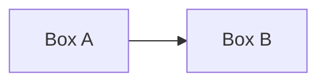
````

That plain text above renders into an actual diagram with two boxes and an arrow.

---

## How to Write a Mermaid Block

Every Mermaid diagram is written inside a **fenced code block** with the language set to `mermaid`:

````markdown
```mermaid
<diagram type goes here>
<diagram content goes here>
```
````

> ⚠️ **WARNING:** The word `mermaid` must be written immediately after the opening triple backticks with **no space**. ` ```mermaid ` is correct. ` ``` mermaid ` with a space will NOT render — it'll just show as a plain code block.

> ⚠️ **WARNING:** Every Mermaid diagram **must start with a diagram type declaration** on the very first line inside the block (e.g., `graph`, `sequenceDiagram`, `classDiagram`, etc.). Without it, Mermaid throws a parse error.

---

## Where Mermaid Works

| Platform | Mermaid Support | Notes |
|----------|----------------|-------|
| **GitHub** | ✅ Native (since 2022) | Works in `.md`, issues, PRs, wikis |
| **GitLab** | ✅ Native | Works in `.md` files |
| **Obsidian** | ✅ Native | Full support in Live Preview |
| **Notion** | ✅ Via code block | Set language to `mermaid` |
| **VS Code** | ✅ Via extension | Install "Markdown Preview Mermaid Support" |
| **Typora** | ✅ Native | Enable in settings |
| **Jupyter Notebook** | ⚠️ Via library | `import mermaid` package needed |
| **Standard Markdown** | ❌ No | Renders as plain code block |
| **Reddit** | ❌ No | Not supported |
| **Stack Overflow** | ❌ No | Not supported |

> ⚠️ **WARNING:** If you open your `.md` file in a basic text editor or a Markdown renderer that doesn't support Mermaid, the diagram will appear as raw text inside a code block — it won't crash, but it won't render visually either.

---

## Diagram Types Overview

| # | Type | Declaration | Best For |
|---|------|-------------|----------|
| 1 | Flowchart | `flowchart` or `graph` | Processes, logic flows, decision trees |
| 2 | Sequence Diagram | `sequenceDiagram` | API calls, message flows, interactions |
| 3 | Class Diagram | `classDiagram` | OOP models, data structures |
| 4 | State Diagram | `stateDiagram-v2` | State machines, lifecycle flows |
| 5 | ER Diagram | `erDiagram` | Database schemas, relationships |
| 6 | Gantt Chart | `gantt` | Project timelines, task scheduling |
| 7 | Pie Chart | `pie` | Proportions, distributions |
| 8 | Quadrant Chart | `quadrantChart` | 2x2 priority/effort matrices |
| 9 | Requirement Diagram | `requirementDiagram` | System requirements, traceability |
| 10 | Gitgraph | `gitGraph` | Git branching strategy |
| 11 | Mindmap | `mindmap` | Brainstorming, concept mapping |
| 12 | Timeline | `timeline` | Historical events, project milestones |
| 13 | Sankey | `sankey-beta` | Flow volumes, resource allocation |
| 14 | XY Chart | `xychart-beta` | Bar charts, line graphs |
| 15 | Block Diagram | `block-beta` | System architecture blocks |
| 16 | Packet Diagram | `packet-beta` | Network packet structure |
| 17 | Architecture | `architecture-beta` | Cloud/system architecture |
| 18 | ZenUML | `zenuml` | Alternative sequence diagrams |
| 19 | Kanban | `kanban` | Kanban boards |

---

## 1. Flowchart

Flowcharts are the most commonly used diagram type. They show **processes, decisions, and data flow** using nodes (shapes) connected by edges (arrows).

### Declaration

```
flowchart <direction>
```

or the older syntax (still works):

```
graph <direction>
```

### Direction Options

| Code | Direction |
|------|-----------|
| `TD` or `TB` | Top to Bottom (default) |
| `BT` | Bottom to Top |
| `LR` | Left to Right |
| `RL` | Right to Left |

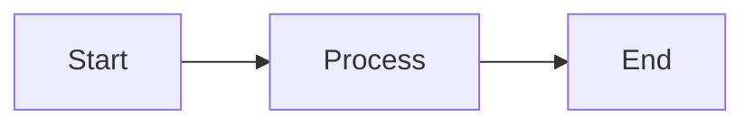

---

### Node Shapes

This is the most important part of flowcharts — different shapes mean different things:

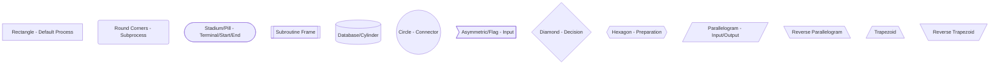

**Shape Syntax Reference:**

|
 Shape 
|
 Syntax 
|
 Typical Use 
|
|
-------
|
--------
|
-------------
|
|
 Rectangle 
|
`[Label]`
|
 Process step 
|
|
 Rounded Rectangle 
|
`(Label)`
|
 Subprocess 
|
|
 Stadium/Pill 
|
`([Label])`
|
 Start / End terminal 
|
|
 Subroutine 
|
`[[Label]]`
|
 Predefined process 
|
|
 Cylinder 
|
`[(Label)]`
|
 Database 
|
|
 Circle 
|
`((Label))`
|
 Connector / Junction 
|
|
 Asymmetric 
|
`>Label]`
|
 Input tag 
|
|
 Diamond 
|
`{Label}`
|
 Decision / If-else 
|
|
 Hexagon 
|
`{{Label}}`
|
 Preparation / Condition 
|
|
 Parallelogram 
|
`[/Label/]`
|
 Input / Output 
|
|
 Reverse Parallelogram 
|
`[\Label\]`
|
 Output 
|
|
 Trapezoid 
|
`[/Label\]`
|
 Manual input 
|
|
 Reverse Trapezoid 
|
`[\Label/]`
|
 Manual operation 
|
|
 Double circle 
|
`(((Label)))`
|
 On-page connector 
|

> ⚠️ **WARNING:** Node IDs and labels are different things. In `A[My Label]`, `A` is the ID used in your code to make connections, and `My Label` is what appears on screen. IDs must be **unique** within the diagram. If you reuse an ID, Mermaid treats it as the same node.

---

### Connections / Edges

```mermaid
flowchart LR
    A --> B
    C --- D
    E --> |Label on arrow| F
    G -- Label text --- H
    I -.-> J
    K -. Label .-> L
    M ==> N
    O == Label ==> P
    Q --o R
    S --x T
    U  V
    W o--o X
    Y x--x Z
```

**Edge Syntax Reference:**

|
 Syntax 
|
 Result 
|
|
--------
|
--------
|
|
`-->`
|
 Arrow (solid) 
|
|
`---`
|
 Line (no arrow) 
|
|
`-->|text|`
|
 Arrow with label 
|
|
`-- text -->`
|
 Arrow with label (alternative) 
|
|
`-.->`
|
 Dotted arrow 
|
|
`-. text .->`
|
 Dotted arrow with label 
|
|
`==>`
|
 Thick arrow 
|
|
`== text ==>`
|
 Thick arrow with label 
|
|
`--o`
|
 Circle endpoint 
|
|
`--x`
|
 Cross/X endpoint 
|
|
`<-->`
|
 Bidirectional arrow 
|
|
`o--o`
|
 Circle on both ends 
|
|
`x--x`
|
 Cross on both ends 
|

> ⚠️ **WARNING:** When adding a **text label on an arrow**, the two syntaxes are:
> - `A -->|label text| B` — pipes wrap the label
> - `A -- label text --> B` — spaces around text with `--`
>
> Do **not** mix them: `A -- label text |B` is invalid.

---

### Subgraphs (Grouping Nodes)

You can group related nodes into a named box called a subgraph:

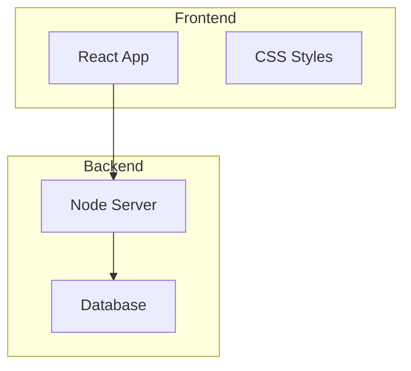

**Subgraph with direction:**
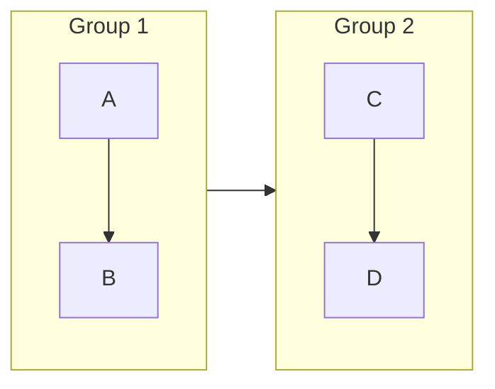

> ⚠️ **WARNING:** Subgraph IDs cannot contain spaces. Use `subgraph myGroup` not `subgraph my group`. If you want a display label with spaces, use: `subgraph myGroup["My Group Label"]`

---

### Styling Nodes

**Inline style:**
```
style NodeID fill:#color,stroke:#color,stroke-width:2px,color:#color
```

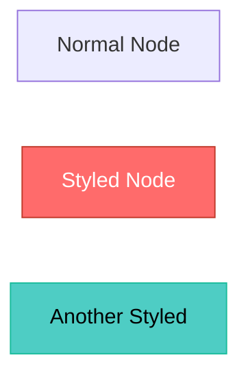

**CSS Classes:**
```
classDef className fill:#color,stroke:#color,color:#color
class nodeID1,nodeID2 className
```

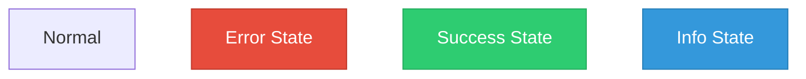

> ⚠️ **WARNING:** Color values in Mermaid styling use **CSS color formats** — hex (`#ff0000`), named colors (`red`), or rgb. Do **not** quote them: `fill:#ff0000` is correct, `fill:"#ff0000"` may break.

---

### Special Node Labels with HTML

You can use HTML inside node labels (in renderers that allow it):

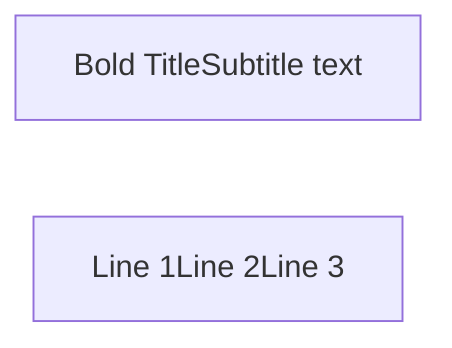

> ⚠️ **WARNING:** HTML in node labels only works when the renderer has `htmlLabels` enabled (GitHub enables this). Not all Mermaid environments support it. Use `<br/>` not `<br>` for line breaks inside labels.

---

## 2. Sequence Diagram

Sequence diagrams show **interactions between participants over time** — great for API flows, system communication, authentication flows, etc.

### Basic Structure

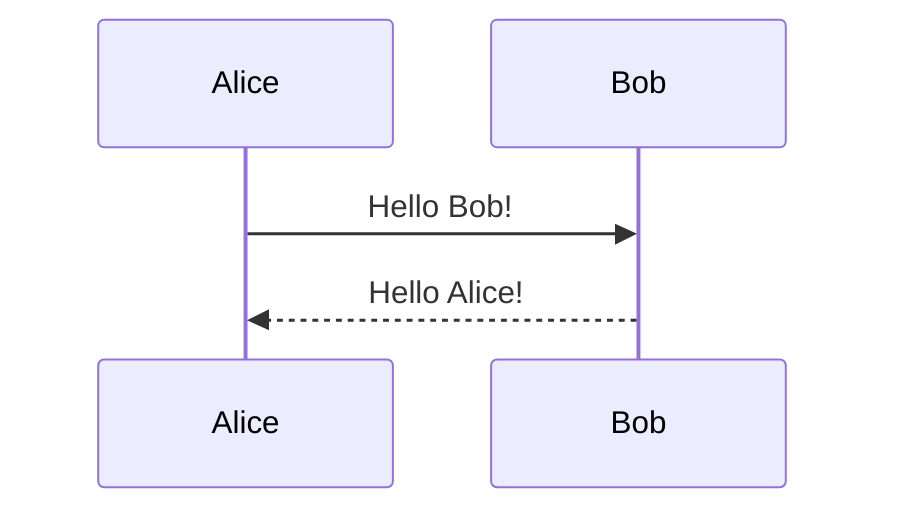

> ⚠️ **WARNING:** The declaration is `sequenceDiagram` — one word, no space, capital D.

---

### Participant Types

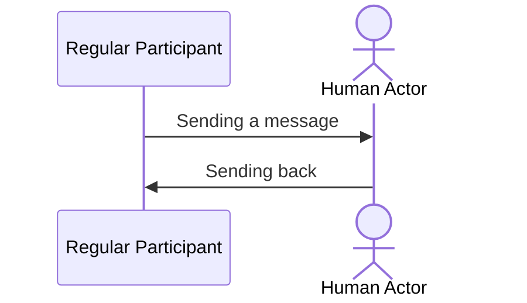

- `participant` — draws a box (system/service)
- `actor` — draws a stick figure (human user)
- `as` — gives a display alias while keeping a short ID

> ⚠️ **WARNING:** Participants are displayed **in the order they are declared** (or first appear). Declare them explicitly at the top if you want to control their order.

---

### Message Types (Arrows)

|
 Syntax 
|
 Arrow Type 
|
 Meaning 
|
|
--------
|
-----------
|
---------
|
|
`->>`
|
 Solid arrow 
|
 Synchronous call 
|
|
`-->>`
|
 Dashed arrow 
|
 Response / async return 
|
|
`->`
|
 Solid open arrow 
|
 Message (no arrowhead) 
|
|
`-->`
|
 Dashed open arrow 
|
 Async message 
|
|
`-x`
|
 Solid with X 
|
 Failed message 
|
|
`--x`
|
 Dashed with X 
|
 Failed async 
|
|
`-)`
|
 Solid async 
|
 Fire and forget 
|
|
`--)`
|
 Dashed async 
|
 Async no response 
|

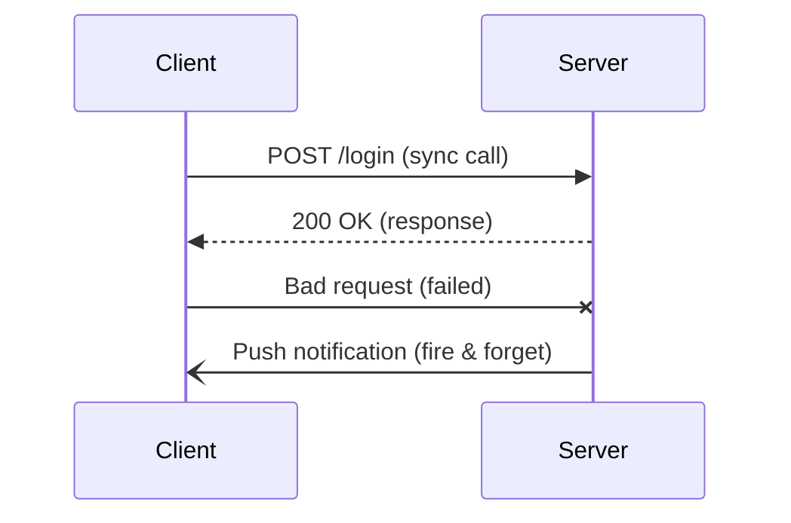

---

### Activation Boxes

Show when a participant is actively processing:

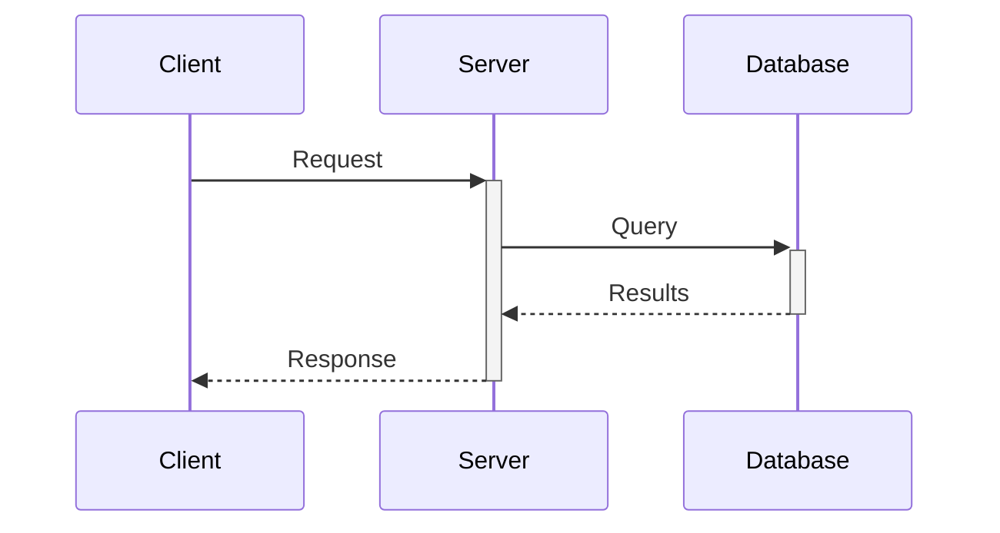

- `+` after the arrow activates (shows the bar)
- `-` after the arrow deactivates

Or explicitly:

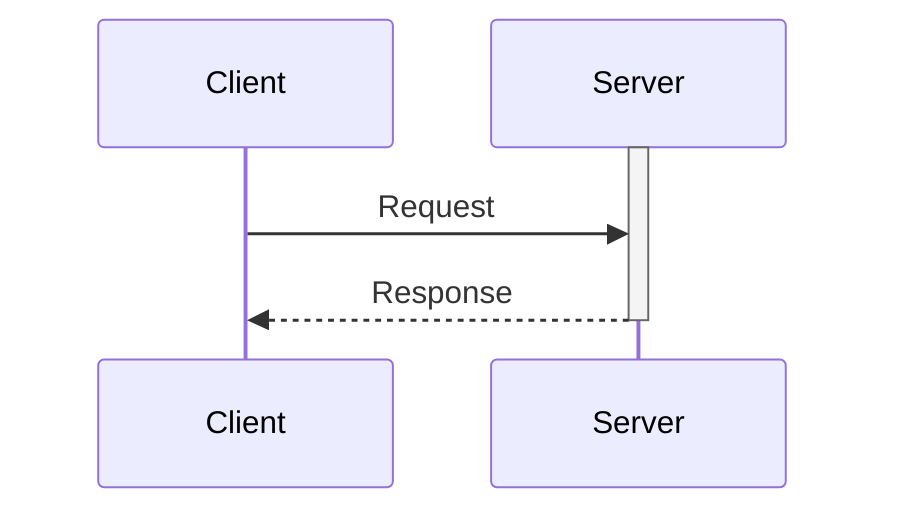

---

### Notes

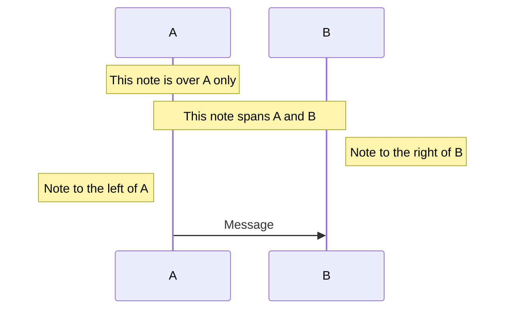

---

### Loops, Alt, Opt, Par, Break

**loop — repeated interactions:**
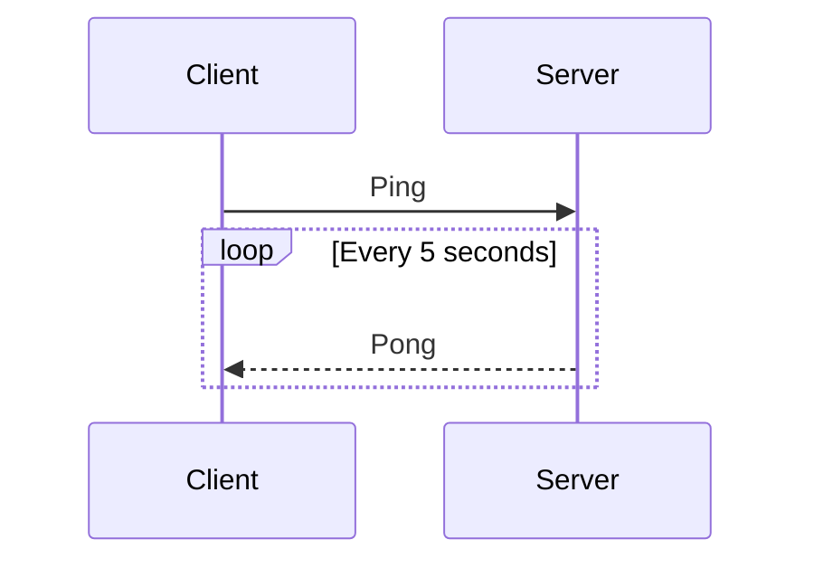

**alt — conditional (if/else):**
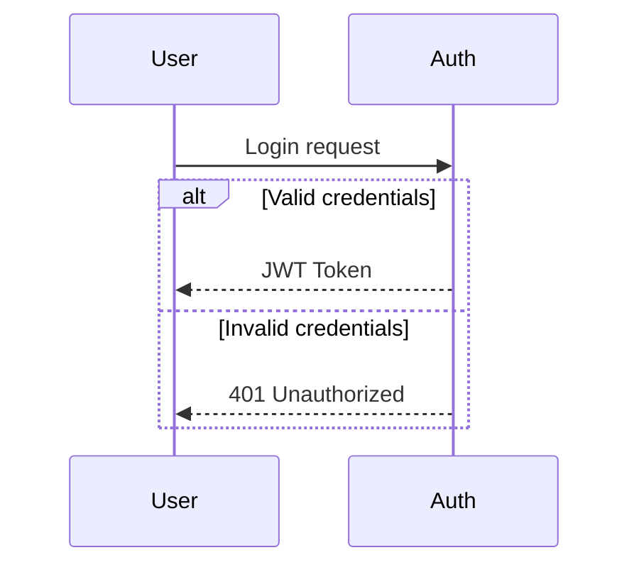

**opt — optional block:**
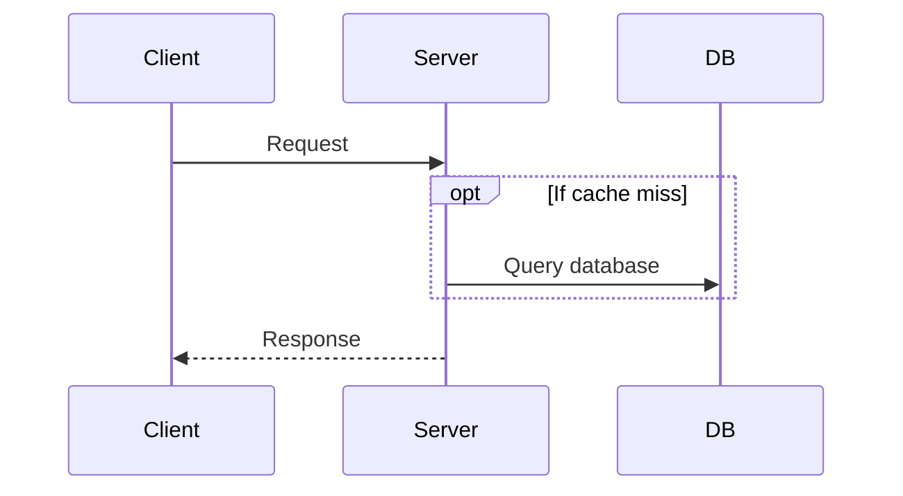

**par — parallel execution:**
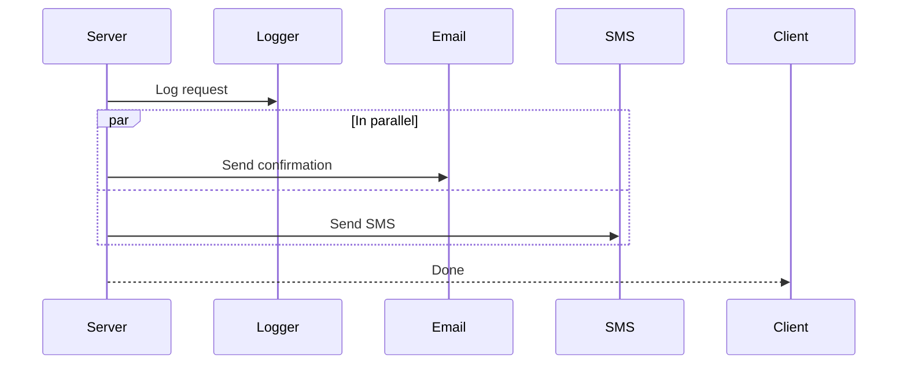

**break — stop on error:**
```mermaid
sequenceDiagram
    Consumer->>API: Request
    break If rate limit exceeded
        API-->>Consumer: 429 Too Many Requests
    end
    API-->>Consumer: 200 OK
```

---

### Auto-numbering

```mermaid
sequenceDiagram
    autonumber
    Alice->>Bob: First message
    Bob-->>Alice: Reply
    Alice->>Bob: Second message
```

> ⚠️ **WARNING:** `autonumber` must be on its own line directly after `sequenceDiagram`, before any participants or messages.

---

## 3. Class Diagram

Class diagrams represent **OOP class structures** — used in software design to show classes, their attributes, methods, and relationships.

### Basic Class

```mermaid
classDiagram
    class Animal {
        +String name
        +int age
        +makeSound() String
        +move() void
    }
```

---

### Visibility Modifiers

|
 Symbol 
|
 Meaning 
|
|
--------
|
---------
|
|
`+`
|
 Public 
|
|
`-`
|
 Private 
|
|
`#`
|
 Protected 
|
|
`~`
|
 Package/Internal 
|

---

### Relationships

```mermaid
classDiagram
    Animal  Person : Association
    Person ..> License : Dependency
    Duck ..|> Flyable : Realization
    Dog -- Cat : Link (plain)
```

**Relationship Types:**

|
 Syntax 
|
 Arrow 
|
 Meaning 
|
|
--------
|
-------
|
---------
|
|
`<|--`
|
 Triangle 
|
 Inheritance (extends) 
|
|
`*--`
|
 Filled diamond 
|
 Composition (owns) 
|
|
`o--`
|
 Empty diamond 
|
 Aggregation (has-a) 
|
|
`-->`
|
 Arrow 
|
 Association 
|
|
`..>`
|
 Dashed arrow 
|
 Dependency 
|
|
`..|>`
|
 Dashed triangle 
|
 Realization (implements) 
|
|
`--`
|
 Line 
|
 Link (plain, no semantics) 
|

> ⚠️ **WARNING:** The **direction of the arrow matters**. `A <|-- B` means B inherits from A (B is a child of A). `A --|> B` is the reverse. Get this backwards and your class diagram conveys the opposite meaning.

---

### Cardinality (Multiplicity)

```mermaid
classDiagram
    Customer "1" --> "0..*" Order : places
    Order "1" --> "1..*" Item : contains
    Person "1" -- "1" Address : has
```

Common cardinality values:
- `1` — exactly one
- `0..1` — zero or one (optional)
- `1..*` — one or more
- `0..*` or `*` — zero or more

---

### Interfaces and Abstract Classes

```mermaid
classDiagram
    class Flyable {
        <>
        +fly() void
    }
    class Shape {
        <>
        +area() float
    }
    class Enum {
        <>
        RED
        GREEN
        BLUE
    }
```

`<<stereotype>>` annotations:
- `<<interface>>`
- `<<abstract>>`
- `<<enumeration>>`
- `<<service>>`

---

### Namespaces

```mermaid
classDiagram
    namespace Animals {
        class Dog {
            +bark()
        }
        class Cat {
            +meow()
        }
    }
    namespace Vehicles {
        class Car {
            +drive()
        }
    }
```

---

## 4. State Diagram

State diagrams show **how a system transitions between states** — great for modeling app states, user flows, or protocol lifecycles.

### Basic State Diagram

```mermaid
stateDiagram-v2
    [*] --> Idle
    Idle --> Running : Start
    Running --> Idle : Stop
    Running --> Error : Crash
    Error --> Idle : Reset
    Idle --> [*]
```

- `[*]` is the **start** and **end** state
- `State --> State : Event/Trigger` defines a transition

> ⚠️ **WARNING:** Use `stateDiagram-v2` not `stateDiagram`. The v1 syntax is deprecated and has fewer features.

---

### State Descriptions

```mermaid
stateDiagram-v2
    [*] --> Still
    Still --> Moving
    Moving --> Still
    Moving --> Crash
    Crash --> [*]

    Still : The object is not moving
    Moving : The object is in motion
    Crash : Collision occurred
```

---

### Composite States (Nested)

```mermaid
stateDiagram-v2
    [*] --> Active

    state Active {
        [*] --> Idle
        Idle --> Processing : Task received
        Processing --> Idle : Task done
    }

    Active --> Inactive : Shutdown
```

---

### Concurrent States (Forked Parallel)

```mermaid
stateDiagram-v2
    [*] --> Active

    state Active {
        [*] --> EngineOn
        --
        [*] --> MusicPlaying
    }
```

`--` separates concurrent regions within a composite state.

---

### Choice / Fork / Join

```mermaid
stateDiagram-v2
    [*] --> CheckAge

    state CheckAge <>
    CheckAge --> Adult : age >= 18
    CheckAge --> Minor : age < 18
    Adult --> [*]
    Minor --> [*]
```

- `<<choice>>` — decision/branch point
- `<<fork>>` — splits into parallel states
- `<<join>>` — merges parallel states

---

### Notes in State Diagrams

```mermaid
stateDiagram-v2
    [*] --> Processing

    note right of Processing
        This step can take
        up to 30 seconds.
    end note

    Processing --> [*]
```

---

## 5. Entity Relationship Diagram (ERD)

ERDs show **database schema** — tables (entities), their columns, and relationships between them.

### Basic ERD

```mermaid
erDiagram
    CUSTOMER {
        int id PK
        string name
        string email
        date created_at
    }
    ORDER {
        int id PK
        int customer_id FK
        float total
        string status
    }
    CUSTOMER ||--o{ ORDER : "places"
```

---

### Attribute Types and Keys

```mermaid
erDiagram
    PRODUCT {
        int id PK "Primary Key"
        int category_id FK "Foreign Key"
        string name
        float price
        int stock
        boolean active
        date created_at
    }
```

- `PK` — Primary Key
- `FK` — Foreign Key
- `UK` — Unique Key
- After the type, quoted string is a comment/description

---

### Relationship Cardinality

Relationships are defined as:

```
EntityA cardinality--cardinality EntityB : "relationship label"
```

|
 Cardinality Symbol 
|
 Meaning 
|
|
-------------------
|
---------
|
|
`\|o`
|
 Zero or one 
|
|
`\|\|`
|
 Exactly one 
|
|
`o{`
|
 Zero or many 
|
|
`\|{`
|
 One or many 
|

```mermaid
erDiagram
    USER ||--o{ POST : "writes"
    POST ||--|{ COMMENT : "has"
    USER ||--o| PROFILE : "has"
    POST }o--o{ TAG : "tagged with"
```

**Read the symbols left to right:**
- `||--o{` means: exactly one (left side) to zero or many (right side)

> ⚠️ **WARNING:** Entity names in ERDs **cannot contain spaces**. Use `CUSTOMER_ORDER` or `CustomerOrder` instead of `Customer Order`. The relationship label (after the colon) can have spaces if quoted.

---

## 6. Gantt Chart

Gantt charts show **project tasks and timelines** — who does what, when, and dependencies between tasks.

### Basic Gantt

```mermaid
gantt
    title Project Alpha Timeline
    dateFormat YYYY-MM-DD

    section Planning
    Kickoff meeting       :done,    p1, 2024-01-01, 2024-01-03
    Requirements          :done,    p2, 2024-01-03, 2024-01-10
    Design mockups        :active,  p3, 2024-01-10, 2024-01-20

    section Development
    Backend API           :         d1, 2024-01-20, 2024-02-10
    Frontend UI           :         d2, 2024-01-25, 2024-02-15
    Integration           :         d3, after d2, 5d

    section Testing
    QA Testing            :crit,    t1, 2024-02-15, 2024-02-25
    Bug fixes             :crit,    t2, after t1, 7d
```

---

### Task Status Keywords

|
 Keyword 
|
 Meaning 
|
 Visual 
|
|
---------
|
---------
|
--------
|
|
`done`
|
 Completed task 
|
 Gray/filled 
|
|
`active`
|
 Currently in progress 
|
 Blue/highlighted 
|
|
`crit`
|
 Critical path task 
|
 Red 
|
|
`milestone`
|
 A single point in time 
|
 Diamond marker 
|

> ⚠️ **WARNING:** Keywords like `done`, `active`, `crit` must come **before the task ID** in the syntax: `:done, taskID, startDate, endDate`. Putting them after the ID will cause a parse error.

---

### Date Formats

```
dateFormat YYYY-MM-DD     ← ISO standard (recommended)
dateFormat DD/MM/YYYY
dateFormat MM-DD-YYYY
```

**Duration shorthands (instead of end date):**
- `3d` — 3 days
- `2w` — 2 weeks
- `1M` — 1 month
- `after taskID` — starts after another task ends

```mermaid
gantt
    title Development Sprint
    dateFormat YYYY-MM-DD
    section Sprint 1
    Task A : a1, 2024-01-01, 3d
    Task B : a2, after a1, 5d
    Task C : a3, after a2, 2d
```

---

### Milestones

```mermaid
gantt
    dateFormat YYYY-MM-DD
    title Release Milestones

    section Milestones
    Design complete    : milestone, m1, 2024-01-15, 0d
    Beta release       : milestone, m2, 2024-02-01, 0d
    Production launch  : milestone, m3, 2024-03-01, 0d
```

> ⚠️ **WARNING:** Milestones must have a duration of `0d`. Any other duration turns them back into a task bar.

---

### Axis Format

```mermaid
gantt
    dateFormat YYYY-MM-DD
    axisFormat %d %b

    section Tasks
    Design : 2024-01-01, 2024-01-15
    Build  : 2024-01-15, 2024-02-01
```

Common `axisFormat` options:
- `%Y-%m-%d` — 2024-01-15
- `%d %b` — 15 Jan
- `%b %Y` — Jan 2024
- `%d/%m` — 15/01

---

## 7. Pie Chart

Simple proportional charts for showing **distributions and percentages**.

```mermaid
pie title Browser Market Share
    "Chrome" : 65.5
    "Safari" : 18.2
    "Firefox" : 8.1
    "Edge" : 5.3
    "Others" : 2.9
```

> ⚠️ **WARNING:** Values in a pie chart do **not need to add up to 100**. Mermaid automatically calculates percentages from the given values. If you want to show 65.5%, just write `65.5`.

> ⚠️ **WARNING:** The `title` line and the `"Label" : value` lines are **required**. Labels must be in **double quotes**. Omitting the quotes will cause a parse error.

**With `showData` to show raw numbers:**

```mermaid
pie showData
    title Disk Usage (GB)
    "OS" : 25
    "Apps" : 80
    "Documents" : 15
    "Media" : 120
    "Free" : 260
```

---

## 8. Quadrant Chart

A 2x2 matrix for plotting items on **two axes** — great for prioritization matrices, effort vs impact, etc.

```mermaid
quadrantChart
    title Feature Prioritization Matrix
    x-axis Low Effort --> High Effort
    y-axis Low Impact --> High Impact

    quadrant-1 Quick Wins
    quadrant-2 Major Projects
    quadrant-3 Fill-ins
    quadrant-4 Thankless Tasks

    Feature A: [0.2, 0.8]
    Feature B: [0.7, 0.9]
    Feature C: [0.3, 0.3]
    Feature D: [0.8, 0.2]
    Feature E: [0.5, 0.6]
```

- Coordinates are `[x, y]` values between `0` and `1`
- `quadrant-1` is top-right, `quadrant-2` is top-left, `quadrant-3` is bottom-left, `quadrant-4` is bottom-right

---

## 9. Requirement Diagram

Models **system requirements and their relationships** — used in systems engineering and requirements traceability.

```mermaid
requirementDiagram

    requirement LoginRequirement {
        id: 1
        text: Users must be able to log in securely
        risk: high
        verifymethod: test
    }

    functionalRequirement AuthRequirement {
        id: 1.1
        text: System shall support MFA
        risk: medium
        verifymethod: inspection
    }

    element AuthModule {
        type: component
    }

    LoginRequirement - contains -> AuthRequirement
    AuthModule - satisfies -> AuthRequirement
```

**Requirement types:** `requirement`, `functionalRequirement`, `performanceRequirement`, `interfaceRequirement`, `designConstraint`, `physicalRequirement`

**Risk levels:** `low`, `medium`, `high`

**Verify methods:** `analysis`, `demonstration`, `inspection`, `test`

**Relationship types:** `contains`, `copies`, `derives`, `satisfies`, `verifies`, `refines`, `traces`

---

## 10. Gitgraph Diagram

Visualizes **Git branching strategies** — commits, branches, merges, and checkouts.

### Basic Gitgraph

```mermaid
gitGraph
    commit id: "Initial commit"
    commit id: "Add README"
    branch feature/login
    checkout feature/login
    commit id: "Add login form"
    commit id: "Add validation"
    checkout main
    commit id: "Fix typo"
    merge feature/login id: "Merge login feature"
    commit id: "Tag v1.0" tag: "v1.0"
```

---

### Commands Reference

|
 Command 
|
 Effect 
|
|
---------
|
--------
|
|
`commit`
|
 Add a commit on current branch 
|
|
`branch name`
|
 Create a new branch 
|
|
`checkout name`
|
 Switch to a branch 
|
|
`merge name`
|
 Merge named branch into current 
|
|
`cherry-pick id: "X"`
|
 Cherry-pick commit by ID 
|

**Commit options:**
- `id: "My message"` — label the commit
- `tag: "v1.0"` — add a version tag
- `type: NORMAL` — default commit
- `type: REVERSE` — shown as reversed colors (revert)
- `type: HIGHLIGHT` — shown as highlighted

```mermaid
gitGraph
    commit id: "feat: A" type: NORMAL
    commit id: "fix: B" type: REVERSE
    commit id: "release: C" type: HIGHLIGHT
```

---

### Gitflow Example

```mermaid
gitGraph
    commit id: "Initial"
    branch develop
    checkout develop
    commit id: "Dev work"
    branch feature/api
    checkout feature/api
    commit id: "API endpoint"
    commit id: "API tests"
    checkout develop
    merge feature/api
    branch release/1.0
    checkout release/1.0
    commit id: "Bump version"
    checkout main
    merge release/1.0 tag: "v1.0"
    checkout develop
    merge release/1.0
```

---

## 11. Mindmap

Creates **hierarchical mind maps** from indented text — great for brainstorming and knowledge organization.

```mermaid
mindmap
    root((Cybersecurity))
        Offensive
            Reconnaissance
                OSINT
                Port Scanning
            Exploitation
                Metasploit
                Custom Exploits
        Defensive
            Monitoring
                SIEM
                IDS/IPS
            Hardening
                Patch Management
                Access Control
        Tools
            Nmap
            Burp Suite
            Wireshark
```

### Node Shapes in Mindmap

|
 Syntax 
|
 Shape 
|
|
--------
|
-------
|
|
`root((text))`
|
 Circle 
|
|
`node[text]`
|
 Rectangle 
|
|
`node(text)`
|
 Rounded rectangle 
|
|
`node{{text}}`
|
 Hexagon 
|
|
`node>text]`
|
 Asymmetric (flag) 
|
|
`node)text(`
|
 Cloud/Explosion 
|
|
`node((text))`
|
 Circle 
|

> ⚠️ **WARNING:** Mindmap uses **indentation to define hierarchy** — not arrow syntax. The number of leading spaces determines the level. Be consistent: use 4 spaces per indent level, or 2 spaces — do not mix.

> ⚠️ **WARNING:** There must be exactly **one root node** — the top-level item with no indentation.

---

## 12. Timeline

Shows **events along a time axis** — great for history, project milestones, biography.

```mermaid
timeline
    title History of Computing
    section 1940s - 1950s
        1943 : ENIAC - First electronic computer
        1947 : Transistor invented at Bell Labs
    section 1960s - 1970s
        1969 : ARPANET - First internet prototype
        1971 : First microprocessor (Intel 4004)
        1976 : Apple founded by Jobs & Wozniak
    section 1980s - 1990s
        1981 : IBM PC released
        1991 : World Wide Web goes public
        1994 : First web browser - Netscape
    section 2000s+
        2004 : Facebook launched
        2007 : iPhone released
        2022 : ChatGPT / AI revolution
```

> ⚠️ **WARNING:** Each event line must follow the format `date : event description`. The `:` separator is required. No quotes needed around the text.

---

## 13. Sankey Diagram

Sankey diagrams show **flow volumes** — how quantities move from sources to destinations. The width of each flow represents its magnitude.

```mermaid
sankey-beta

%% Source,Target,Value
Salary,Taxes,500
Salary,Rent,1200
Salary,Food,400
Salary,Savings,600
Salary,Entertainment,300
Savings,Investments,400
Savings,Emergency Fund,200
```

> ⚠️ **WARNING:** Sankey uses **CSV format** for data: `Source,Target,Value` — one flow per line. No spaces around the commas. Labels cannot contain commas.

> ⚠️ **WARNING:** `sankey-beta` is in **beta** — the syntax may change in future Mermaid versions. It works on GitHub and Obsidian but may not be available in all renderers.

---

## 14. XY Chart

Supports **bar charts and line graphs** on an XY axis.

### Bar Chart

```mermaid
xychart-beta
    title "Monthly Revenue ($000s)"
    x-axis [Jan, Feb, Mar, Apr, May, Jun, Jul, Aug, Sep, Oct, Nov, Dec]
    y-axis "Revenue (thousands)" 0 --> 120
    bar [45, 62, 58, 71, 83, 95, 88, 102, 91, 110, 98, 115]
```

### Line Chart

```mermaid
xychart-beta
    title "CPU Usage Over Time"
    x-axis ["Mon", "Tue", "Wed", "Thu", "Fri", "Sat", "Sun"]
    y-axis "Usage (%)" 0 --> 100
    line [45, 72, 68, 55, 80, 30, 25]
```

### Combined Bar + Line

```mermaid
xychart-beta
    title "Revenue vs Expenses"
    x-axis [Q1, Q2, Q3, Q4]
    y-axis "Amount ($000s)" 0 --> 200
    bar [120, 145, 160, 180]
    line [80, 95, 100, 110]
```

> ⚠️ **WARNING:** `xychart-beta` is still in **beta** as of Mermaid v10+. The syntax is stable for basic use but may have rendering inconsistencies in some environments.

> ⚠️ **WARNING:** X-axis labels must be inside `[...]` brackets. Numeric range for the y-axis uses the format `minValue --> maxValue`.

---

## 15. Block Diagram

Block diagrams show **system components as blocks** with connections — useful for high-level architecture.

```mermaid
block-beta
    columns 3

    A["User Browser"]:1
    space
    B["Load Balancer"]:1

    A --> B

    block:backend["Backend Services"]:3
        C["Auth Service"]
        D["API Gateway"]
        E["Worker Service"]
    end

    B --> C
    B --> D
    D --> E
```

> ⚠️ **WARNING:** `block-beta` is a newer diagram type with more complex syntax. The `columns N` declaration controls the grid layout. Block sizing uses `:N` after the block ID.

---

## 16. Packet Diagram

Visualizes **network packet / binary protocol structures** — showing fields, their bit widths, and layout.

```mermaid
packet-beta
    title "IPv4 Header"
    0-3: "Version"
    4-7: "IHL"
    8-15: "Type of Service"
    16-31: "Total Length"
    32-47: "Identification"
    48-50: "Flags"
    51-63: "Fragment Offset"
    64-71: "TTL"
    72-79: "Protocol"
    80-95: "Header Checksum"
    96-127: "Source IP"
    128-159: "Destination IP"
```

```mermaid
packet-beta
    title "TCP Header"
    0-15: "Source Port"
    16-31: "Destination Port"
    32-63: "Sequence Number"
    64-95: "Acknowledgment Number"
    96-99: "Data Offset"
    100-105: "Reserved"
    106-111: "Control Bits"
    112-127: "Window Size"
    128-143: "Checksum"
    144-159: "Urgent Pointer"
```

Syntax: `startBit-endBit: "Field Name"`

---

## 17. Architecture Diagram

For showing **cloud / microservice / infrastructure** layouts with icons and service groups.

```mermaid
architecture-beta
    group cloud(cloud)[Cloud Infrastructure]
    group backend(server)[Backend]

    service lb(internet)[Load Balancer] in cloud
    service web1(server)[Web Server 1] in backend
    service web2(server)[Web Server 2] in backend
    service db(database)[PostgreSQL] in cloud
    service cache(disk)[Redis Cache] in cloud

    lb:R --> L:web1
    lb:R --> L:web2
    web1:B --> T:db
    web2:B --> T:db
    web1:R --> L:cache
    web2:R --> L:cache
```

**Direction markers:** `L` (left), `R` (right), `T` (top), `B` (bottom)

> ⚠️ **WARNING:** `architecture-beta` support varies. It's fully supported in Mermaid v10.9+. Check your renderer version before using.

---

## 18. ZenUML Sequence Diagram

An **alternative sequence diagram** syntax that is more code-like:

```mermaid
zenuml
    title Order Processing
    @Actor Client
    @Boundary API
    @Database OrderDB

    Client -> API: POST /orders {item, qty}
    API -> OrderDB: INSERT order
    OrderDB --> API: order_id
    API --> Client: 201 Created {order_id}

    if (stock < qty) {
        API -> Client: 409 Out of Stock
    }
```

> ⚠️ **WARNING:** ZenUML uses a **different syntax** from standard `sequenceDiagram`. They are not interchangeable. ZenUML has better support for conditionals but fewer features overall.

---

## 19. Kanban Diagram

Visualizes a **Kanban board** with columns and cards — useful for tracking work in progress.

```mermaid
kanban
    column1[Backlog]
        task1[Write unit tests]
        task2[Design database schema]
        task3[Create API docs]

    column2[In Progress]
        task4[Build login page]@{ assigned: 'dev1', priority: 'High' }
        task5[Fix auth bug]@{ assigned: 'dev2', priority: 'Critical' }

    column3[Review]
        task6[PR review for logout]@{ assigned: 'dev3' }

    column4[Done]
        task7[Project setup]
        task8[Initial wireframes]
```

> ⚠️ **WARNING:** `kanban` is one of the newest diagram types and has **limited support** — it works in Mermaid v11+ only. Check renderer compatibility.

---

## Global Theming and Styling

### Built-in Themes

Set the theme using `%%{init: {...}}%%` at the top:

```mermaid
%%{init: {'theme': 'dark'}}%%
flowchart LR
    A --> B --> C
```

Available themes:
- `default` — light gray (default)
- `dark` — dark background
- `forest` — green tones
- `base` — minimal, easily customized
- `neutral` — neutral tones

---

### Custom Theme Variables

```mermaid
%%{init: {
  'theme': 'base',
  'themeVariables': {
    'primaryColor': '#1a1a2e',
    'primaryTextColor': '#ffffff',
    'primaryBorderColor': '#e94560',
    'lineColor': '#e94560',
    'secondaryColor': '#16213e',
    'tertiaryColor': '#0f3460'
  }
}}%%
flowchart TD
    A[Client] --> B[Server]
    B --> C[Database]
```

**Common theme variables:**

|
 Variable 
|
 Controls 
|
|
----------
|
----------
|
|
`primaryColor`
|
 Main node fill color 
|
|
`primaryTextColor`
|
 Text inside nodes 
|
|
`primaryBorderColor`
|
 Node border color 
|
|
`lineColor`
|
 Arrow/edge color 
|
|
`secondaryColor`
|
 Secondary node fill 
|
|
`tertiaryColor`
|
 Tertiary node fill 
|
|
`background`
|
 Diagram background 
|
|
`fontSize`
|
 Base font size 
|

---

### Config Options

```mermaid
%%{init: {
  'theme': 'dark',
  'flowchart': {
    'curve': 'basis',
    'nodeSpacing': 50,
    'rankSpacing': 80,
    'htmlLabels': true
  }
}}%%
flowchart LR
    A --> B --> C
```

**Curve options for flowcharts:**
- `basis` — smooth curved
- `linear` — straight lines
- `cardinal` — slightly curved
- `monotoneX` / `monotoneY` — step-like

---

## Comments in Mermaid

```mermaid
flowchart LR
    %% This is a comment — it will not appear in the diagram
    A --> B
    %% Another comment explaining the next connection
    B --> C
```

> ⚠️ **WARNING:** Mermaid comments use `%%` — **not** `//` or `#` or `<!-- -->`. Using the wrong comment syntax will either cause a parse error or appear as literal text in the diagram.

---

## Common Errors and How to Fix Them

### Error: "Parse error on line X"

The most common Mermaid error. Causes:
- Missing space after arrow (`A-->B` vs `A --> B` — both usually work, but label syntax is strict)
- Special characters in node IDs (spaces, hyphens can cause issues)
- Unclosed quotes in labels
- Wrong keyword (e.g., `stateDiagram` instead of `stateDiagram-v2`)

**Fix:** Quote node labels that contain special characters:
```
A["Node with spaces and (parens)"] --> B
```

---

### Node IDs with Special Characters

If your node ID must contain special characters, wrap the label in quotes:

```mermaid
flowchart LR
    node1["This label has spaces and (parentheses)!"]
    node2["It can have: colons, dashes - and more"]
    node1 --> node2
```

> ⚠️ **WARNING:** The **node ID** (the part before `[...]`) should only contain letters, numbers, and underscores. Special characters in the ID (not the label) will cause parse errors. Use `my_node["My Node Label"]` — clean ID, descriptive label.

---

### Diagram Not Rendering (Just Shows Code)

Causes:
1. The renderer doesn't support Mermaid
2. There's a syntax error somewhere in the block
3. The language tag is ` ```mermaid ` with a leading space

**Debug tip:** Copy your Mermaid code into [mermaid.live](https://mermaid.live) — the official online editor — to see errors in real time.

---

### Quotes Inside Labels

To use quotes inside a label, use HTML entity `&quot;`:

```mermaid
flowchart LR
    A["He said "hello""]
```

---

### Long Labels Breaking Layout

Long text in nodes can make diagrams look cramped. Use `<br/>` to split lines:

```mermaid
flowchart TD
    A["Step 1:Initialize the databaseand check connection"]
    B["Step 2:Run migrations"]
    A --> B
```

---

## Cheat Sheet

---

### Diagram Type Declarations

```
flowchart TD/LR/RL/BT/TB
graph TD/LR/RL/BT/TB
sequenceDiagram
classDiagram
stateDiagram-v2
erDiagram
gantt
pie
quadrantChart
requirementDiagram
gitGraph
mindmap
timeline
sankey-beta
xychart-beta
block-beta
packet-beta
architecture-beta
zenuml
kanban
```

---

### Flowchart Node Shapes

```
A[Rectangle]
B(Rounded)
C([Pill/Stadium])
D[[Subroutine]]
E[(Database)]
F((Circle))
G>Asymmetric]
H{Diamond}
I{{Hexagon}}
J[/Parallelogram/]
K[\Reverse Para\]
```

---

### Flowchart Edge Types

```
A --> B            solid arrow
A --- B            solid line
A -->|label| B     arrow with label
A -- text --> B    arrow with label (alt)
A -.-> B           dotted arrow
A ==> B            thick arrow
A --o B            circle end
A --x B            cross end
A <--> B           bidirectional
```

---

### Sequence Diagram Arrows

```
A->>B: sync call
A-->>B: async response
A-xB: failed message
A-)B: fire and forget
A<->>B: bidirectional
```

---

### Sequence Blocks

```
loop Description
    ...
end

alt Condition true
    ...
else Condition false
    ...
end

opt Optional
    ...
end

par Parallel
    ...
and
    ...
end
```

---

### Class Diagram Relationships

```
A <|-- B      Inheritance
A *-- B       Composition
A o-- B       Aggregation
A --> B       Association
A ..> B       Dependency
A ..|> B      Realization
A -- B        Link
```

---

### State Diagram

```
[*] --> State1       Entry point
State1 --> State2 : Event
State1 --> [*]       Exit point
State1 : Description text
<<choice>>  <<fork>>  <<join>>
```

---

### ERD Cardinality

```
A ||--|| B    one to exactly one
A ||--o| B    one to zero or one
A ||--|{ B    one to one or many
A ||--o{ B    one to zero or many
A }o--o{ B    zero or many to zero or many
```

---

### Gantt Chart

```
gantt
    title My Gantt
    dateFormat YYYY-MM-DD
    axisFormat %d %b

    section SectionName
    Task       :done, id1, 2024-01-01, 3d
    Task       :active, id2, after id1, 5d
    Task       :crit, id3, 2024-01-10, 7d
    Milestone  :milestone, m1, 2024-01-15, 0d
```

**Status:** `done`, `active`, `crit`
**Duration:** `3d`, `2w`, `1M`, `after taskID`

---

### Theming

```
%%{init: {'theme': 'dark'}}%%

Themes: default | dark | forest | base | neutral

%%{init: {
  'theme': 'base',
  'themeVariables': {
    'primaryColor': '#1a1a2e',
    'lineColor': '#e94560'
  }
}}%%
```

---

### Comments

```
%% This is a Mermaid comment
```

---

### Subgraph (Flowchart)

```
subgraph GroupID["Display Name"]
    direction LR
    A --> B
end
```

---

### Styling Nodes

```
style NodeID fill:#hex,stroke:#hex,color:#hex,stroke-width:2px

classDef myClass fill:#hex,stroke:#hex,color:#hex
class node1,node2 myClass
node1:::myClass
```

---

### Critical Rules Summary

|
 Rule 
|
 Correct 
|
 Wrong 
|
|
------
|
---------
|
-------
|
|
 Backtick language tag 
|
 ` ```mermaid 
` | `
 ``` mermaid ` (space) 
|
|
 First line must be diagram type 
|
`flowchart LR`
|
 Nothing on first line 
|
|
 Comments 
|
`%% comment`
|
`// comment`
 or 
`# comment`
|
|
 State diagram version 
|
`stateDiagram-v2`
|
`stateDiagram`
|
|
 Node IDs 
|
`myNode`
 (no spaces) 
|
`my node`
 (spaces) 
|
|
 Labels with special chars 
|
`A["my (label)"]`
|
`A[my (label)]`
|
|
 Arrow with label 
|
`A -->|text| B`
|
`A --> text B`
|
|
 Mindmap hierarchy 
|
 Indentation only 
|
 Arrow syntax 
|
|
 Gantt task status keyword 
|
 Before ID 
|
 After ID 
|
|
 Pie chart labels 
|
`"Label" : value`
|
`Label : value`
|
|
 ERD entity names 
|
`MY_ENTITY`
|
`MY ENTITY`
 (space) 
|
|
 YML init block 
|
 First line before type 
|
 After diagram content 
|

---

*End of The Complete Mermaid Diagrams Guide*
*Live editor for testing: https://mermaid.live*
